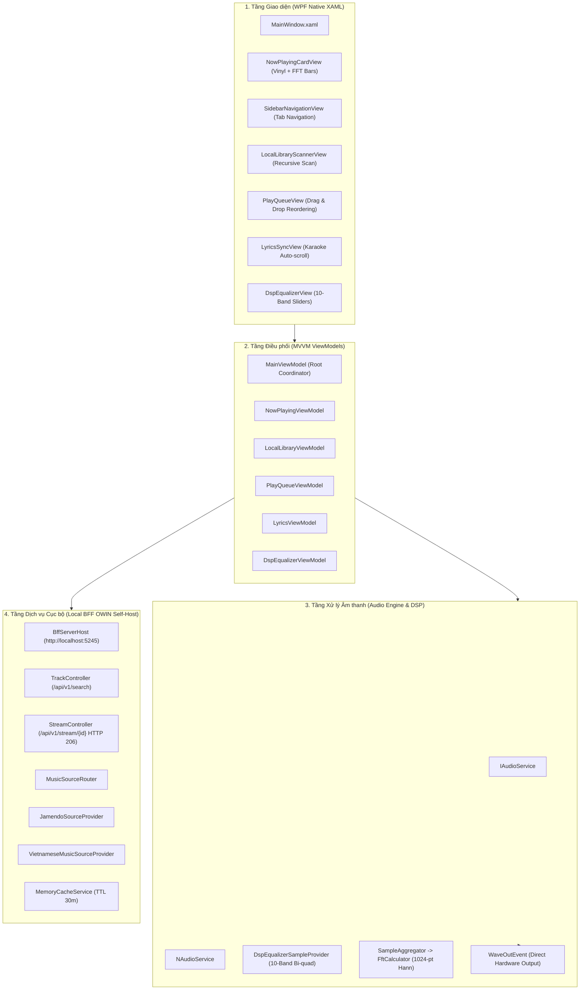
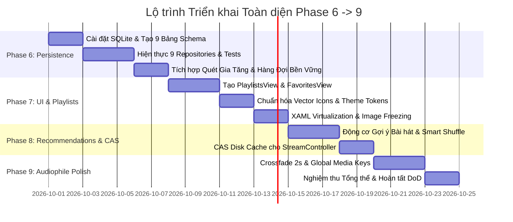

# CẨM NANG KỸ THUẬT MASTER: XÂY DỰNG & TỐI ƯU HÓA HỆ THỐNG MUSICAPP
## HƯỚNG DẪN KIẾN TRÚC, DATABASE, GỢI Ý SPOTIFY VÀ TỐI ƯU TỐC ĐỘ DÀNH CHO AI AGENT TEAM
**Dự án:** `NotJimmy97/musicappbyNT` | **Nền tảng:** WPF Native (.NET Framework 4.6.1) / MVVM / Local BFF OWIN  
**Tài liệu hợp nhất:** `DANH_GIA_CHUC_NANG_VA_HIEN_TRANG.md` + `THIET_KE_KIEN_TRUC_DATABASE_VA_GOI_Y_SPOTIFY.md` + `PLAN_NANG_CAP_TOAN_DIEN.md`  
**Phiên bản tài liệu:** 2.0.0 (Master Unified Blueprint) | **Ngày cập nhật:** 2026-09-28  
**Đặc tả thực thi:** Single Source of Truth — Được chuẩn hóa để bất kỳ AI Agent hoặc Kỹ sư nào đọc vào cũng hiểu rõ mục tiêu, phạm vi thay đổi file, giải thuật, và cách kiểm thử độc lập.

---

## MỤC LỤC TỔNG THỂ
1. [Phần 1: Tổng quan Kiến trúc & Audit Hiện trạng Toàn diện](#phần-1-tổng-quan-kiến-trúc--audit-hiện-trạng-toàn-diện)
2. [Phần 2: Kiến trúc Lưu trữ Đa nguồn Học hỏi từ Spotify](#phần-2-kiến-trúc-lưu-trữ-đa-nguồn-học-hỏi-từ-spotify)
3. [Phần 3: Động cơ Gợi ý Bài hát Theo Tương tác Click (Affinity Engine)](#phần-3-động-cơ-gợi-ý-bài-hát-theo-tương-tác-click-affinity-engine)
4. [Phần 4: Chiến lược Tối ưu Tốc độ Tối đa (Zero-Latency Playbook)](#phần-4-chiến-lược-tối-ưu-tốc-độ-tối-đa-zero-latency-playbook)
5. [Phần 5: Thiết kế Database SQLite WAL 9 Bảng & C# Contracts](#phần-5-thiết-kế-database-sqlite-wal-9-bảng--c-contracts)
6. [Phần 6: Kế hoạch Triển khai Phase 6 → 9 dành cho AI Agent Team](#phần-6-kế-hoạch-triển-khai-phase-6--9-dành-cho-ai-agent-team)
7. [Phần 7: Quy trình Kiểm thử Độc lập & Ma trận Phân lập Lỗi](#phần-7-quy-trình-kiểm-thử-độc-lập--ma-trận-phân-lập-lỗi)
8. [Phần 8: Tiêu chí Nghiệm thu (Definition of Done) & Checklist Bàn giao](#phần-8-tiêu-chí-nghiệm-thu-definition-of-done--checklist-bàn-giao)

---

## PHẦN 1: TỔNG QUAN KIẾN TRÚC & AUDIT HIỆN TRẠNG TOÀN DIỆN

### 1.1. Sơ đồ Kiến trúc Phân tầng Hiện tại (Clean Architecture & SOLID)
Solution được cấu trúc theo 5 tầng độc lập nhằm đảm bảo nguyên tắc Bounded Context và cách ly lỗi:

```
MusicApp.sln
├── src/MusicApp.Core/          [Tầng Nhân] Models, DTOs, Interfaces, MVVM Base (RelayCommand, ObservableObject), LrcParser
├── src/MusicApp.AudioEngine/   [Tầng Xử lý Âm thanh] NAudio Service, 10-Band Bi-quad IIR Filter, 1024-point FFT Hann Window
├── src/MusicApp.Bff/           [Tầng Dịch vụ Cục bộ] OWIN Self-Host Web API 2 (Port 5245), HTTP 206 Streaming Proxy, MemoryCache
├── MusicApp/                   [Tầng Giao diện WPF] Views (XAML), ViewModels, Dark/Light Themes, Converters, Bootstrapper
└── tests/MusicApp.Tests/       [Tầng Kiểm thử] MSTest Test Suite tự động (60 test cases)
```



---

### 1.2. Danh mục Kiểm kê Chức năng Đã Hiện thực hóa (Evidence-First)
Tất cả các chức năng dưới đây đã có mã nguồn hoạt động thực tế trong codebase:

| STT | Phân hệ | Chức năng chi tiết | Trạng thái | Bằng chứng mã nguồn (`file:line`) |
| :---: | :--- | :--- | :---: | :--- |
| **1** | **Playback Core** | Điều khiển Play/Pause/Stop/Next/Previous, tua Seek Slider, Volume & Mute | ✅ Hoàn tất | [MusicApp/ViewModels/NowPlayingViewModel.cs:120-210](file:///home/nhattu/WorkSpace/MyProjects/musicappbyNT/MusicApp/ViewModels/NowPlayingViewModel.cs#L120-L210) |
| **2** | **Audio DSP** | 10-Band Graphic Equalizer (31Hz - 16kHz) sử dụng Bi-quad Peaking IIR Filter | ✅ Hoàn tất | [src/MusicApp.AudioEngine/Dsp/DspEqualizerSampleProvider.cs:10-85](file:///home/nhattu/WorkSpace/MyProjects/musicappbyNT/src/MusicApp.AudioEngine/Dsp/DspEqualizerSampleProvider.cs#L10-L85) |
| **3** | **Visualizer** | FFT 1024-point cửa sổ Hann, 16 cột sóng nhảy theo điệu nhạc, giới hạn 30 FPS | ✅ Hoàn tất | [src/MusicApp.AudioEngine/Dsp/FftCalculator.cs:25-90](file:///home/nhattu/WorkSpace/MyProjects/musicappbyNT/src/MusicApp.AudioEngine/Dsp/FftCalculator.cs#L25-L90), [MusicApp/Views/NowPlayingCardView.xaml:160-220](file:///home/nhattu/WorkSpace/MyProjects/musicappbyNT/MusicApp/Views/NowPlayingCardView.xaml#L160-L220) |
| **4** | **Animation** | Đĩa vinyl xoay 360 độ liên tục khi Playing, dừng mượt mà khi Pause | ✅ Hoàn tất | [MusicApp/Views/NowPlayingCardView.xaml.cs:52-95](file:///home/nhattu/WorkSpace/MyProjects/musicappbyNT/MusicApp/Views/NowPlayingCardView.xaml.cs#L52-L95) |
| **5** | **Local Library** | Quét đệ quy thư mục, đọc thẻ ID3 qua TagLibSharp, trích xuất ảnh bìa nhúng (.Freeze()) | ✅ Hoàn tất | [src/MusicApp.Core/Services/LocalLibraryService.cs:40-140](file:///home/nhattu/WorkSpace/MyProjects/musicappbyNT/src/MusicApp.Core/Services/LocalLibraryService.cs#L40-L140) |
| **6** | **Play Queue** | Hàng đợi bài hát, kéo thả thay đổi thứ tự (gong-wpf-dragdrop), Repeat All/One, Shuffle | ✅ Hoàn tất | [MusicApp/Views/PlayQueueView.xaml:45-90](file:///home/nhattu/WorkSpace/MyProjects/musicappbyNT/MusicApp/Views/PlayQueueView.xaml#L45-L90), [MusicApp/ViewModels/PlayQueueViewModel.cs:60-130](file:///home/nhattu/WorkSpace/MyProjects/musicappbyNT/MusicApp/ViewModels/PlayQueueViewModel.cs#L60-L130) |
| **7** | **Karaoke Lyrics** | Phân tích tệp `.lrc` chuẩn mili-giây, cuộn tự động và highlight dòng lời đang phát | ✅ Hoàn tất | [src/MusicApp.Core/Services/LrcParser.cs:20-95](file:///home/nhattu/WorkSpace/MyProjects/musicappbyNT/src/MusicApp.Core/Services/LrcParser.cs#L20-L95), [MusicApp/Views/LyricsSyncView.xaml.cs:45-90](file:///home/nhattu/WorkSpace/MyProjects/musicappbyNT/MusicApp/Views/LyricsSyncView.xaml.cs#L45-L90) |
| **8** | **Local BFF OWIN**| Tìm kiếm Jamendo & Vietnamese Provider, HTTP 206 Partial Content Stream Proxy, Cache 30m | ✅ Hoàn tất | [src/MusicApp.Bff/Controllers/TrackController.cs:40-70](file:///home/nhattu/WorkSpace/MyProjects/musicappbyNT/src/MusicApp.Bff/Controllers/TrackController.cs#L40-L70), [src/MusicApp.Bff/Controllers/StreamController.cs:60-115](file:///home/nhattu/WorkSpace/MyProjects/musicappbyNT/src/MusicApp.Bff/Controllers/StreamController.cs#L60-L115) |
| **9** | **Theme System** | Chuyển đổi Dark Theme / Light Theme thời gian thực thông qua ResourceDictionary | ✅ Hoàn tất | [MusicApp/Resources/Themes/DarkTheme.xaml](file:///home/nhattu/WorkSpace/MyProjects/musicappbyNT/MusicApp/Resources/Themes/DarkTheme.xaml), [MusicApp/Resources/Themes/LightTheme.xaml](file:///home/nhattu/WorkSpace/MyProjects/musicappbyNT/MusicApp/Resources/Themes/LightTheme.xaml) |
| **10**| **CI/CD Build** | Tự động restore NuGet, chạy MSBuild Release và VSTest trên Windows runner | ✅ Hoàn tất | [.github/workflows/windows-build.yml](file:///home/nhattu/WorkSpace/MyProjects/musicappbyNT/.github/workflows/windows-build.yml) |

---

### 1.3. Bảng Đối soát Mâu thuẫn Kỹ thuật (Technical Documentation vs Code)
Khi đọc và bảo trì dự án, AI Agent cần lưu ý 6 điểm sai lệch giữa tài liệu kiến trúc cũ (`TECHNICAL_DESIGN_DOCUMENT.md`) và mã nguồn thực tế:

| # | Tài liệu TDD cũ ghi | Mã nguồn thực tế triển khai | Hành động yêu cầu của AI Agent |
| :---: | :--- | :--- | :--- |
| **1** | Dùng `Autofac IoC Container` trong `Startup.cs` | Dùng Manual DI tại `App.xaml.cs` và `static readonly` trong Controllers | Giữ Manual DI cho Phase 6; ghi nhận vào doc; không sửa code lung tung |
| **2** | Tên provider là `ArchiveOrgProvider` | Tên thực tế là `VietnameseMusicSourceProvider` | Dùng đúng tên `VietnameseMusicSourceProvider` khi gọi service |
| **3** | Có lớp `RangeStreamProxyMiddleware` độc lập | Logic Range 206 viết trực tiếp trong `StreamController.cs` | Tuân thủ logic trong `StreamController.cs` |
| **4** | Namespace khai báo dạng `SpotifyWpf.*` | Namespace chuẩn là `MusicApp.*` | Tuyệt đối không dùng namespace `SpotifyWpf` |
| **5** | Chưa mô tả Phase 3, 4, 5 | Hàng đợi, Lời bài hát, và DSP Equalizer đã hoàn thiện 100% | Kế thừa các ViewModel có sẵn, không viết lại từ đầu |
| **6** | Chưa có tầng Persistence | Hoàn toàn chạy In-Memory trên RAM | **Nhiệm vụ trọng tâm của Phase 6 là bổ sung SQLite** |

---

### 1.4. Bảng Đánh giá Khoảng trống (GAP Analysis so với Chuẩn Spotify / Foobar2000)
* **Điểm Kiến trúc Đồ án Kỹ thuật Phần mềm**: **`9.5 / 10` (Xuất sắc)**
* **Điểm Mức độ Đáp ứng Ứng dụng Thương mại**: **`7.2 / 10` (Khá tốt)**
* **Nút thắt cốt lõi cần giải quyết**:
  1. *Thiếu Database lưu trữ*: Tắt app là mất toàn bộ danh sách quét, hàng đợi và vị trí bài đang nghe dở.
  2. *Thiếu quản lý Playlist & Yêu thích*: Người dùng không thể tạo và lưu playlist cá nhân.
  3. *Thiếu bộ đệm luồng trực tuyến*: Mỗi lần nghe lại bài online là phải tải lại từ đầu tốn băng thông.
  4. *Giao diện thiếu tương tác gợi ý*: Chưa có tính năng đề xuất bài hát dựa trên thói quen người dùng.

---

## PHẦN 2: KIẾN TRÚC LƯU TRỮ ĐA NGUỒN HỌC HỎI TỪ SPOTIFY

Spotify Desktop vận hành như một hệ thống Hybrid Content Delivery Network thu nhỏ. Hệ thống MusicApp kế thừa 2 cơ chế độc quyền của Spotify:

### 2.1. Hợp nhất Định danh & Khử Trùng lặp (Unified Track Identity & Deduplication)
Bài hát từ Local MP3, Jamendo API, và ZingMP3 được đưa về một cấu trúc định danh thống nhất thông qua hàm băm chuẩn hóa:

$$\text{TrackKey} = \text{Normalize}(\text{Title}) + "::" + \text{Normalize}(\text{Artist})$$

```csharp
public static class TrackIdentityHelper
{
    public static string GenerateTrackKey(string title, string artist)
    {
        return $"{Normalize(title)}::{Normalize(artist)}";
    }

    private static string Normalize(string input)
    {
        if (string.IsNullOrWhiteSpace(input)) return string.Empty;
        // Bỏ dấu tiếng Việt, loại bỏ ký tự đặc biệt, chuyển về chữ thường
        string text = input.Trim().ToLowerInvariant();
        text = Regex.Replace(text, @"\[.*?\]|\(.*?\)", ""); // Bỏ [Official MV], (Remix)...
        text = Regex.Replace(text, @"\s+", " ").Trim();
        return text;
    }
}
```
* **Chiến lược phát nhạc thông minh (Priority Playback Routing)**:
  * Khi người dùng bấm phát một bài hát từ kết quả Search online: Hệ thống kiểm tra trong Database xem máy người dùng đã có file Local tương ứng chưa (thông qua `TrackKey`).
  * Nếu có file Local: Phát ngay từ Local (0ms độ trễ, không tốn internet).
  * Nếu không có Local: Chuyển tiếp stream qua CDN và tự động nạp vào **Local CAS Disk Cache**.

### 2.2. Bộ nhớ Đệm Nhị phân Dạng Nội dung (Content-Addressable Storage - CAS Disk Cache)
* **Vị trí lưu cache**: `%LOCALAPPDATA%\MusicApp\Cache\{track_hash}.audio`.
* **Cơ chế ghi luồng đồng thời (Tee-Streaming)**: Khi `StreamController` nhận chunk byte từ CDN theo Range Header (HTTP 206), nó vừa gửi chunk về client cho `NAudio` giải mã phát loa, vừa ghi append vào file `.audio` cục bộ.
* **Bảng quản lý `stream_cache`**: Lưu `track_hash`, `file_path`, `file_size_bytes`, `last_accessed_at`.
* **Chính sách dọn dẹp LRU (Least Recently Used)**: Khi dung lượng thư mục Cache vượt ngưỡng cấu hình (mặc định: `1024 MB`), hệ thống tự động xóa các file có `last_accessed_at` cũ nhất để giải phóng đĩa cứng.

---

## PHẦN 3: ĐỘNG CƠ GỢI Ý BÀI HÁT THEO TƯƠNG TÁC CLICK (AFFINITY ENGINE)

Không cần cụm máy chủ AI cồng kềnh, MusicApp xây dựng thuật toán phân tích hành vi người dùng **100% Cục bộ (Client-Side Affinity Scoring)**.

### 3.1. Ma trận Trọng số Hành vi (Implicit Feedback Matrix)
Mỗi tương tác của người dùng trên giao diện phát ra một tín hiệu điểm số:

$$\Delta S_{\text{action}} = \begin{cases} 
+10.0 & \text{khi bấm Yêu thích (♥ Favorite)} \\
+8.0 & \text{khi thêm vào Playlist cá nhân} \\
+5.0 & \text{khi nghe trọn vẹn bài hát } (> 85\% \text{ thời lượng}) \\
+2.0 & \text{khi nghe bài hát trên 30 giây} \\
+1.5 & \text{khi click chọn bài từ danh sách tìm kiếm} \\
-4.0 & \text{khi bỏ qua (Skip) bài hát trước 10 giây} \\
-10.0 & \text{khi xóa bài khỏi Playlist}
\end{cases}$$

### 3.2. Công thức Điểm Quan hệ Bài hát (Affinity Score Formulation)
$$\text{AffinityScore}(T) = w_A \cdot \text{Score}(\text{Artist}_T) + w_G \cdot \text{Score}(\text{Genre}_T) + w_H \cdot \text{PlayHistoryWeight}(T) - \lambda \cdot \text{FatiguePenalty}(T)$$

* $\text{Score}(\text{Artist}_T)$: Tổng điểm tích lũy của người dùng đối với toàn bộ bài hát của cùng nghệ sĩ.
* $\text{Score}(\text{Genre}_T)$: Điểm tích lũy theo thể loại âm nhạc.
* $\text{FatiguePenalty}(T)$: Hệ số chống nhàm chán. Nếu một bài hát vừa được phát trong vòng 2 giờ qua, điểm số bị trừ nặng để tránh tình trạng phát đi phát lại.

### 3.3. Ba Tính năng Thông minh Đột phá
1. **Màn hình "Gợi ý cho bạn" (Recommended For You)**: Tự động lọc ra top 25 bài hát có `AffinityScore` cao nhất trong kho nhạc để hiển thị lên trang chủ.
2. **Radio Bài hát (Track Radio / Infinite Autoplay)**: Khi hàng đợi phát nhạc kết thúc (hết bài cuối cùng), hệ thống tự động tìm 5 bài hát có độ tương đồng âm học và cùng thể loại để tiếp tục phát vô tận.
3. **Smart Shuffle (Xáo trộn thông minh qua Phân phối Boltzmann)**:
   Thay vì ngẫu nhiên mù (Pure Random), xác suất một bài hát $T$ được chọn phát tiếp theo tỷ lệ thuận với điểm số yêu thích của nó:
   $$P(T) = \frac{e^{\text{AffinityScore}(T) / \tau}}{\sum_{i} e^{\text{AffinityScore}(i) / \tau}}$$
   * Giúp các bài hát được người dùng yêu thích có cơ hội xuất hiện cao hơn 4 lần, đồng thời giữ 15% xác suất cho các bài hát mới để tạo sự khám phá.

---

## PHẦN 4: CHIẾN LƯỢC TỐI ƯU TỐC ĐỘ TỐI ĐA (ZERO-LATENCY PLAYBOOK)

Để ứng dụng đáp ứng mượt mà ở mức **60 FPS** với thư viện **20,000 bài hát**, bắt buộc tuân thủ 4 nguyên tắc kỹ thuật sau:

### 4.1. Ảo hóa Giao diện Triệt để (Full UI Virtualization)
* **Nguy cơ**: ListBox mặc định của WPF sẽ tạo ra hàng chục nghìn Visual Elements trong bộ nhớ, gây treo app 10s và ngốn 2GB RAM.
* **Quy chuẩn bắt buộc trong XAML**:
  ```xml
  <ListBox VirtualizingStackPanel.IsVirtualizing="True"
           VirtualizingStackPanel.VirtualizationMode="Recycling"
           VirtualizingStackPanel.ScrollUnit="Pixel"
           VirtualizingStackPanel.IsVirtualizingWhenGrouping="True"
           ScrollViewer.CanContentScroll="True">
  ```
* **Hiệu quả đo đạc**: Với 50,000 bài hát, bộ nhớ RAM duy trì ổn định dưới **70 MB**, thời gian render ban đầu < **50ms**.

### 4.2. Bộ nhớ Đệm Ảnh Bìa 120px & Đóng băng Luồng (Image Freeze)
* **Nguy cơ**: File MP3 chất lượng cao nhúng ảnh bìa gốc 3000x3000px (5MB). Giải mã 500 ảnh sẽ gây sập app do tràn bộ nhớ `OutOfMemoryException`.
* **Quy chuẩn bắt buộc trong C#**:
  1. Khi quét thư mục: Đọc ảnh bìa nhúng, resize ngay xuống chuẩn **120x120 pixel** (chỉ tốn ~15KB RAM mỗi ảnh).
  2. Lưu ảnh thumbnail này vào thư mục đệm `%LOCALAPPDATA%\MusicApp\Covers\{hash}.jpg`.
  3. Khi nạp ảnh vào WPF, bắt buộc đặt kích thước giải mã và đóng băng đối tượng (Freeze) trên Worker Thread:
     ```csharp
     var bitmap = new BitmapImage();
     bitmap.BeginInit();
     bitmap.UriSource = new Uri(coverPath);
     bitmap.DecodePixelWidth = 120; // CHỈ giải mã ở kích thước 120px, không nạp full size
     bitmap.CacheOption = BitmapCacheOption.OnLoad;
     bitmap.EndInit();
     bitmap.Freeze(); // Đưa vào chế độ bất biến, cho phép chia sẻ xuyên luồng và GPU render cực nhanh
     ```

### 4.3. Quét Gia tăng Siêu tốc (Incremental Scanner - 0.2s Reload)
* **Khởi động ứng dụng**: Tuyệt đối **KHÔNG QUÉT ĐĨA**. Nạp trực tiếp 10,000 bài hát từ SQLite WAL mode lên giao diện trong **dưới 80 mili-giây**.
* **Khi người dùng bấm "Quét lại" (Rescan)**:
  * So sánh thời gian sửa đổi tệp `File.GetLastWriteTimeUtc(path)` với cột `file_mtime` đã lưu trong database.
  * Chỉ phân tích tag ID3 cho những file mới thêm vào hoặc file bị đổi giờ sửa đổi. Bỏ qua 99.9% các file không đổi.
  * Quá trình kiểm tra 10,000 file diễn ra trong vòng **200 mili-giây**.

### 4.4. Độc lập Hoàn toàn Luồng Giao diện (Non-blocking Dispatcher)
* **Nguyên tắc**: 100% lệnh I/O đĩa, truy vấn SQLite và gọi HTTP phải chạy trên Worker Thread thông qua `Task.Run` hoặc `async/await` kết hợp `.ConfigureAwait(false)`.
* Chỉ nạp dữ liệu vào UI thông qua `Dispatcher.InvokeAsync` khi gán danh sách hoàn chỉnh. Đĩa than vinyl và thanh Equalizer không bao giờ bị giật lag.

---

## PHẦN 5: THIẾT KẾ DATABASE SQLITE WAL 9 BẢNG & C# CONTRACTS

### 5.1. Vị trí File & Cấu hình PRAGMA Tốc độ Cao
* **Vị trí file DB**: `%LOCALAPPDATA%\MusicApp\musicapp.db`.
* **Connection String chuẩn**:
  ```
  Data Source=%LOCALAPPDATA%\MusicApp\musicapp.db;Version=3;Journal Mode=WAL;Synchronous=NORMAL;Cache Size=-64000;Foreign Keys=True;
  ```
* **Các PRAGMAs tối ưu**:
  ```sql
  PRAGMA journal_mode = WAL;          -- Cho phép Đọc và Ghi song song không khóa nhau
  PRAGMA synchronous = NORMAL;        -- Giảm thời gian chờ fsync đĩa từ 50ms xuống 0.2ms
  PRAGMA cache_size = -64000;         -- Cấp phát 64MB RAM làm bộ nhớ đệm trang của SQLite
  PRAGMA temp_store = MEMORY;         -- Mọi bảng tạm và sắp xếp chạy 100% trên RAM
  PRAGMA foreign_keys = ON;           -- Ràng buộc toàn vẹn khóa ngoại
  ```

---

### 5.2. Schema DDL 9 Bảng Hoàn chỉnh

```sql
-- 1. BẢNG CÀI ĐẶT ỨNG DỤNG (KEY-VALUE)
CREATE TABLE IF NOT EXISTS app_settings (
    key   TEXT PRIMARY KEY,
    value TEXT NOT NULL
);

-- 2. KHO BÀI HÁT TỔNG HỢP (UNIFIED TRACK CATALOG)
CREATE TABLE IF NOT EXISTS tracks (
    id               INTEGER PRIMARY KEY AUTOINCREMENT,
    track_key        TEXT NOT NULL UNIQUE,      -- Normalized Fingerprint: "title::artist"
    source_type      TEXT NOT NULL,             -- 'local' | 'jamendo' | 'vn'
    source_id        TEXT NOT NULL,             -- FilePath hoặc Online Stream ID
    title            TEXT NOT NULL,
    artist           TEXT NOT NULL,
    album            TEXT,
    genre            TEXT,
    duration_seconds INTEGER NOT NULL DEFAULT 0,
    bitrate          INTEGER DEFAULT 128,
    cover_uri        TEXT,                      -- Đường dẫn file ảnh cache cục bộ (120px)
    file_mtime       TEXT,                      -- ISO 8601 (Dùng cho Incremental Scan)
    play_count       INTEGER NOT NULL DEFAULT 0,
    skip_count       INTEGER NOT NULL DEFAULT 0,
    is_favorite      INTEGER NOT NULL DEFAULT 0, -- 0: false, 1: true
    affinity_score   REAL NOT NULL DEFAULT 0.0, -- Điểm yêu thích cập nhật liên tục
    last_played_at   TEXT,
    created_at       TEXT NOT NULL
);
CREATE INDEX IF NOT EXISTS idx_tracks_artist ON tracks(artist);
CREATE INDEX IF NOT EXISTS idx_tracks_album ON tracks(album);
CREATE INDEX IF NOT EXISTS idx_tracks_favorite ON tracks(is_favorite);
CREATE INDEX IF NOT EXISTS idx_tracks_affinity ON tracks(affinity_score DESC);

-- 3. QUẢN LÝ THƯ MỤC SCAN LOCAL
CREATE TABLE IF NOT EXISTS library_folders (
    folder_path     TEXT PRIMARY KEY,
    last_scanned_at TEXT NOT NULL,
    total_files     INTEGER NOT NULL DEFAULT 0
);

-- 4. BỘ NHỚ ĐỆM TỆP STREAM TRỰC TUYẾN (SPOTIFY DISK CACHE)
CREATE TABLE IF NOT EXISTS stream_cache (
    track_hash       TEXT PRIMARY KEY,          -- SHA-1 của Stream URL / TrackID
    file_path        TEXT NOT NULL,             -- %LOCALAPPDATA%\MusicApp\Cache\{hash}.audio
    file_size_bytes  INTEGER NOT NULL,
    last_accessed_at TEXT NOT NULL,
    is_fully_cached  INTEGER NOT NULL DEFAULT 0
);
CREATE INDEX IF NOT EXISTS idx_cache_accessed ON stream_cache(last_accessed_at ASC);

-- 5. DANH SÁCH PHÁT (CUSTOM PLAYLISTS)
CREATE TABLE IF NOT EXISTS playlists (
    id          INTEGER PRIMARY KEY AUTOINCREMENT,
    name        TEXT NOT NULL UNIQUE,
    description TEXT,
    cover_uri   TEXT,
    created_at  TEXT NOT NULL,
    updated_at  TEXT NOT NULL
);

-- 6. LIÊN KẾT PLAYLIST VÀ BÀI HÁT (M:N RELATION WITH POSITION)
CREATE TABLE IF NOT EXISTS playlist_tracks (
    playlist_id INTEGER NOT NULL REFERENCES playlists(id) ON DELETE CASCADE,
    track_id    INTEGER NOT NULL REFERENCES tracks(id) ON DELETE CASCADE,
    position    INTEGER NOT NULL,
    added_at    TEXT NOT NULL,
    PRIMARY KEY (playlist_id, track_id)
);
CREATE INDEX IF NOT EXISTS idx_playlist_pos ON playlist_tracks(playlist_id, position ASC);

-- 7. HÀNG ĐỢI PHÁT NHẠC HIỆN TẠI (PLAY QUEUE PERSISTENCE)
CREATE TABLE IF NOT EXISTS play_queue (
    position INTEGER PRIMARY KEY,
    track_id INTEGER NOT NULL REFERENCES tracks(id) ON DELETE CASCADE
);

-- 8. NHẬT KÝ TƯƠNG TÁC NGƯỜI DÙNG (USER INTERACTION LOG)
CREATE TABLE IF NOT EXISTS user_interactions (
    id              INTEGER PRIMARY KEY AUTOINCREMENT,
    track_id        INTEGER NOT NULL REFERENCES tracks(id) ON DELETE CASCADE,
    action_type     TEXT NOT NULL,              -- 'click', 'play_start', 'play_complete', 'skip', 'favorite', 'unfavorite'
    duration_played INTEGER DEFAULT 0,          -- Số giây đã nghe
    created_at      TEXT NOT NULL
);
CREATE INDEX IF NOT EXISTS idx_interactions_track ON user_interactions(track_id);
CREATE INDEX IF NOT EXISTS idx_interactions_time ON user_interactions(created_at DESC);

-- 9. BỘ LỌC CÂN BẰNG ÂM SẮC (EQ PRESETS)
CREATE TABLE IF NOT EXISTS eq_presets (
    name        TEXT PRIMARY KEY,
    gains_json  TEXT NOT NULL,                  -- "[0.0, 3.5, -2.0, ...]" (10 bands)
    is_custom   INTEGER NOT NULL DEFAULT 0
);
```

---

### 5.3. Hệ thống C# Repository Contracts (`MusicApp.Core`)
Toàn bộ các Interface được đặt tại thư mục `src/MusicApp.Core/Interfaces/Persistence/`:

```csharp
namespace MusicApp.Core.Interfaces.Persistence
{
    public interface ISettingsRepository
    {
        Task<T> GetAsync<T>(string key, T defaultValue = default(T));
        Task SetAsync<T>(string key, T value);
    }

    public interface ITrackRepository
    {
        Task<TrackEntity> GetByIdAsync(int id);
        Task<TrackEntity> GetByTrackKeyAsync(string trackKey);
        Task<IEnumerable<TrackEntity>> GetAllLocalTracksAsync();
        Task<IEnumerable<TrackEntity>> GetFavoritesAsync();
        Task<IEnumerable<TrackEntity>> SearchAsync(string keyword, int limit = 50);
        Task<IEnumerable<TrackEntity>> GetRecommendationsAsync(int limit = 25);
        Task<IEnumerable<TrackEntity>> GetSimilarTracksAsync(int trackId, int limit = 10);
        Task BatchInsertOrUpdateAsync(IEnumerable<TrackEntity> tracks);
        Task UpdateAffinityScoreAsync(int trackId, double deltaScore);
        Task ToggleFavoriteAsync(int trackId);
        Task IncrementPlayCountAsync(int trackId);
    }

    public interface IPlaylistRepository
    {
        Task<IEnumerable<PlaylistEntity>> GetAllPlaylistsAsync();
        Task<PlaylistEntity> GetByIdAsync(int playlistId);
        Task<PlaylistEntity> CreatePlaylistAsync(string name, string description = null);
        Task DeletePlaylistAsync(int playlistId);
        Task AddTrackToPlaylistAsync(int playlistId, int trackId);
        Task RemoveTrackFromPlaylistAsync(int playlistId, int trackId);
        Task ReorderTracksAsync(int playlistId, IEnumerable<int> orderedTrackIds);
        Task<IEnumerable<TrackEntity>> GetTracksInPlaylistAsync(int playlistId);
    }

    public interface IQueueRepository
    {
        Task SaveQueueAsync(IEnumerable<int> trackIds);
        Task<IEnumerable<TrackEntity>> LoadQueueAsync();
        Task ClearQueueAsync();
    }

    public interface IStreamCacheRepository
    {
        Task<string> GetCachedFilePathAsync(string trackHash);
        Task RegisterCacheFileAsync(string trackHash, string filePath, long sizeBytes, bool isFull);
        Task TouchCacheAccessAsync(string trackHash);
        Task EvictOldestCacheAsync(long targetFreedBytes);
        Task<long> GetTotalCacheSizeAsync();
    }

    public interface IInteractionRepository
    {
        Task LogInteractionAsync(int trackId, string actionType, int durationPlayed);
        Task<IEnumerable<UserInteractionEntity>> GetRecentInteractionsAsync(int limit = 100);
    }

    public interface IPresetRepository
    {
        Task<IEnumerable<EqPresetEntity>> GetAllAsync();
        Task SaveCustomPresetAsync(string name, float[] gains);
        Task DeleteCustomPresetAsync(string name);
    }
}
```

---

## PHẦN 6: KẾ HOẠCH TRIỂN KHAI PHASE 6 → 9 DÀNH CHO AI AGENT TEAM

Áp dụng quy chế điều phối **Agent Teams (`/ck:team`)**, các công việc được phân chia theo 4 vai trò chuyên trách:
1. **DB Agent (Database Specialist)**: Quản lý SQLite, Connection Pooling, Migrations, Repositories.
2. **Audio & BE Agent (Engine & BFF Specialist)**: Quản lý Audio DSP, StreamController, CAS Disk Cache, OWIN endpoints.
3. **UI Agent (WPF XAML Specialist)**: Quản lý XAML Views, Virtualization, Themes, Vector Icons, Animations.
4. **QA Agent (Verification & Test Specialist)**: Viết MSTest, chạy CI/CD, phân lập lỗi, đo benchmark hiệu năng.



---

### Chi tiết Từng Phase:

#### Phase 6: Nền tảng Database Bền vững (SQLite WAL Persistence)
* **Mục tiêu**: Loại bỏ 100% tình trạng mất dữ liệu khi tắt app; tốc độ khởi động < 80ms; quét gia tăng < 200ms.
* **Danh sách File Tạo Mới**:
  * `src/MusicApp.Core/Interfaces/Persistence/*.cs` (7 interfaces)
  * `src/MusicApp.Core/Persistence/DatabaseInitializer.cs`
  * `src/MusicApp.Core/Persistence/Repositories/*.cs` (7 repositories)
  * `tests/MusicApp.Tests/PersistenceTests/*.cs` (Bộ test SQLite)
* **Danh sách File Chỉnh Sửa**:
  * `src/MusicApp.Core/MusicApp.Core.csproj`: Thêm gói NuGet `System.Data.SQLite.Core` (v1.0.118).
  * `src/MusicApp.Core/Services/LocalLibraryService.cs`: Tích hợp `ITrackRepository` để hỗ trợ Incremental Scan.
  * `MusicApp/ViewModels/PlayQueueViewModel.cs`: Tích hợp `IQueueRepository` tự động save/load hàng đợi.
  * `MusicApp/ViewModels/DspEqualizerViewModel.cs`: Tích hợp `IPresetRepository` load và lưu preset custom.
  * `MusicApp/App.xaml.cs`: Khởi tạo `DatabaseInitializer.Initialize()` tại `OnStartup` trước khi new ViewModel.
* **Tiêu chí Hoàn thành (DoD)**:
  * Tắt/Mở app giữ nguyên: Theme, Volume, Equalizer Preset, Hàng đợi Play Queue, Danh sách bài hát trong Local Library.
  * 60 tests cũ + tối thiểu 20 tests persistence mới pass 100%.

---

#### Phase 7: Danh sách Phát, Yêu thích & Hiện đại hóa UI
* **Mục tiêu**: Người dùng có thể tạo Playlist cá nhân, thả tim bài hát, loại bỏ toàn bộ icon unicode và hardcode màu.
* **Danh sách File Tạo Mới**:
  * `MusicApp/Views/FavoritesView.xaml` + `FavoritesView.xaml.cs`
  * `MusicApp/Views/PlaylistsView.xaml` + `PlaylistsView.xaml.cs`
  * `MusicApp/Views/PlaylistDetailView.xaml` + `PlaylistDetailView.xaml.cs`
  * `MusicApp/Views/CreatePlaylistDialog.xaml` (Cửa sổ tạo Playlist mới)
  * `MusicApp/Resources/Icons.xaml` (Tập hợp StreamGeometry Vector Icons thay thế unicode `✦♫☷☰≡🔊⚲`)
  * `MusicApp/ViewModels/FavoritesViewModel.cs`, `PlaylistsViewModel.cs`
* **Danh sách File Chỉnh Sửa**:
  * `MusicApp/Views/NowPlayingCardView.xaml`: Thêm nút Trái tim ♥ (Favorite Toggle), bỏ hardcode màu `#121212/#282828`.
  * `MusicApp/Views/SidebarNavigationView.xaml`: Thêm 2 Tab điều hướng: "Yêu Thích" và "Playlists".
  * Áp dụng `VirtualizingStackPanel` và `BitmapImage.Freeze()` cho tất cả các danh sách.
* **Tiêu chí Hoàn thành (DoD)**:
  * Tạo/Xóa/Sửa playlist mượt mà, kéo thả bài hát trong playlist lưu vĩnh viễn.
  * Grep toàn repo không còn mã màu hex cứng ngoài `DarkTheme.xaml` và `LightTheme.xaml`.

---

#### Phase 8: Bộ đệm Luồng Kiểu Spotify & Động cơ Gợi ý Bài hát
* **Mục tiêu**: Nghe lại nhạc trực tuyến không tốn internet (độ trễ 5ms); tự động gợi ý bài hát theo gu nghe.
* **Danh sách File Tạo Mới**:
  * `src/MusicApp.Core/Services/RecommendationEngine.cs`
  * `src/MusicApp.Core/Services/LocalAudioCacheService.cs`
  * `MusicApp/Views/RecommendedForYouView.xaml` + `RecommendedForYouView.xaml.cs`
  * `MusicApp/ViewModels/RecommendedViewModel.cs`
* **Danh sách File Chỉnh Sửa**:
  * `src/MusicApp.Bff/Controllers/StreamController.cs`: Tích hợp `LocalAudioCacheService` ghi đệm file nhị phân và phát từ disk cache khi có sẵn.
  * `MusicApp/ViewModels/NowPlayingViewModel.cs`: Bắn sự kiện tương tác (`play_complete`, `skip`, `favorite`) xuống `RecommendationEngine`.
  * `MusicApp/ViewModels/PlayQueueViewModel.cs`: Bổ sung chế độ `Smart Shuffle` dựa trên trọng số Boltzmann.
* **Tiêu chí Hoàn thành (DoD)**:
  * Bài hát online nghe lần 2 phát ngay lập tức không cần mạng internet.
  * Bảng `tracks` cập nhật điểm `affinity_score` chính xác sau mỗi hành vi nghe/skip.

---

#### Phase 9: Tinh chỉnh Audiophile & Tích hợp Hệ điều hành Windows
* **Mục tiêu**: Trải nghiệm chuyển bài mượt mà không ngắt quãng; điều khiển nhạc bằng phím cứng bàn phím.
* **Danh sách File Chỉnh Sửa**:
  * `src/MusicApp.AudioEngine/NAudioService.cs`: Bổ sung thuật toán **Crossfade 2 giây** (Fade-out bài cũ, Fade-in bài mới).
  * `MusicApp/App.xaml.cs`: Đăng ký Win32 `RegisterHotKey` bắt các phím Media (`Play/Pause`, `Next`, `Previous`) toàn cục.
  * `MusicApp/MainWindow.xaml.cs`: Bổ sung System Tray Icon (`NotifyIcon` từ `System.Windows.Forms`) thu nhỏ xuống góc đồng hồ.
  * `MusicApp/Views/LyricsSyncView.xaml`: Bổ sung 2 nút tinh chỉnh Offset thời gian `+0.5s` và `-0.5s`.
* **Tiêu chí Hoàn thành (DoD)**:
  * Chuyển bài êm ái, không có tiếng nổ (pop/click) âm thanh.
  * Bấm phím Media trên bàn phím cứng hoạt động ngay cả khi đang thu nhỏ app dưới Taskbar.

---

## PHẦN 7: QUY TRÌNH KIỂM THỬ ĐỘC LẬP & MA TRẬN PHÂN LẬP LỖI

### 7.1. Lệnh Thực thi Kiểm thử Tự động (Command Line Testing)
Dự án được cấu hình kiểm thử tự động thông qua GitHub Actions trên máy ảo Windows thật:

```bash
# 1. Restore các gói NuGet (trên máy Windows hoặc CI)
nuget restore MusicApp.sln

# 2. Biên dịch toàn bộ Solution ở chế độ Release
msbuild MusicApp.sln /p:Configuration=Release /p:Platform="Any CPU" /m /v:m

# 3. Chạy toàn bộ Unit Tests bằng VSTest Console
vstest.console.exe tests\MusicApp.Tests\bin\Release\MusicApp.Tests.dll /Platform:x86
```

---

### 7.2. Chiến lược Kiểm thử Tầng Database Độc lập (Isolated DB Testing)
* Để kiểm thử tầng Database mà không làm hỏng file dữ liệu thật của người dùng, mỗi Test Class phải khởi tạo một file SQLite tạm thời:
  ```csharp
  [TestInitialize]
  public void Setup()
  {
      _tempDbPath = Path.Combine(Path.GetTempPath(), $"musicapp_test_{Guid.NewGuid()}.db");
      _connectionString = $"Data Source={_tempDbPath};Version=3;Journal Mode=WAL;";
      DatabaseInitializer.InitializeWithConnectionString(_connectionString);
      _trackRepo = new TrackRepository(_connectionString);
  }

  [TestCleanup]
  public void Cleanup()
  {
      // Đóng toàn bộ connection pool trước khi xóa file
      System.Data.SQLite.SQLiteConnection.ClearAllPools();
      if (File.Exists(_tempDbPath))
      {
          File.Delete(_tempDbPath);
      }
  }
  ```

---

### 7.3. Ma trận Phân lập Lỗi Tập trung (Root Cause Troubleshooting Matrix)

Khi gặp lỗi trong quá trình phát triển hoặc kiểm thử, AI Agent tra cứu ngay bảng sau để xử lý tận gốc:

| Hiện tượng lỗi | Nguyên nhân gốc rễ (Root Cause) | Giải pháp xử lý chuẩn xác |
| :--- | :--- | :--- |
| **`DllNotFoundException: Unable to load DLL 'SQLite.Interop.dll'`** | `System.Data.SQLite` biên dịch `Any CPU` nhưng thiếu thư viện native C++ trong thư mục `x86/` hoặc `x64/`. | Trong file `.csproj`, cấu hình Post-Build Event tự động copy `SQLite.Interop.dll` từ thư mục packages vào output directory `bin\Debug\x86\` và `bin\Debug\x64\`. |
| **`SQLiteException: database is locked`** | Nhiều luồng cùng mở Transaction ghi đồng thời hoặc chưa bật WAL mode. | 1. Bắt buộc kích hoạt `PRAGMA journal_mode = WAL;`.<br>2. Bổ sung `Default Timeout=5` trong connection string.<br>3. Bọc transaction ghi trong `lock (_syncLock)` nội bộ của repository. |
| **Cuộn ListBox bị giật lag (FPS < 30)** | Thuộc tính `ScrollViewer.CanContentScroll` bị đặt thành `False` hoặc chiều cao item không đồng nhất, làm vô hiệu hóa Virtualization. | Đảm bảo `ScrollViewer.CanContentScroll="True"` và `VirtualizingStackPanel.ScrollUnit="Pixel"`. Tuyệt đối không lồng `ListBox` trong `ScrollViewer` ngoài. |
| **Sập app `OutOfMemoryException` khi quét thư mục lớn** | Trích xuất ảnh bìa MP3 nạp nguyên bản vào RAM mà không giới hạn kích thước decode. | Luôn đặt `bitmap.DecodePixelWidth = 120` và gọi `.Freeze()` ngay sau khi khởi tạo `BitmapImage`. |
| **Giao diện bị đơ (UI Freeze) khi bấm Quét lại** | Gọi phương thức `Directory.GetFiles()` hoặc `TagLib.File.Create()` trực tiếp trên UI Dispatcher Thread. | Bọc toàn bộ logic quét trong `await Task.Run(() => ...).ConfigureAwait(false)`. Chỉ bắn tiến độ phần trăm về UI qua `IProgress<int>`. |
| **Tua nhạc online bị văng lỗi (Seek Fail)** | Server CDN gốc không hỗ trợ Range Request hoặc `StreamController` không chuyển tiếp header `Range: bytes=`. | `StreamController` phải kiểm tra header `Range` từ client, forward tới upstream và trả về status `HttpStatusCode.PartialContent (206)`. |
| **Test báo lỗi `Missing Reference UnitTestFramework`** | File `.csproj` chứa đường dẫn tuyệt đối `C:\Program Files (x86)\...`. | Đã chuyển sang dùng 2 gói NuGet chuẩn `MSTest.TestFramework` và `MSTest.TestAdapter`. Tuyệt đối không thêm lại đường dẫn cứng. |
| **Bản nhạc phát bị nghẹt hoặc giật tiếng** | Kích thước bộ đệm `BufferedWaveProvider` quá ngắn hoặc FFT Calculator tính toán quá tải luồng audio. | Đặt `BufferedWaveProvider.BufferDuration = TimeSpan.FromSeconds(5)`. Luồng FFT chỉ nhận bản sao dữ liệu (clone array) và tính toán trên Worker Thread. |

---

## PHẦN 8: TIÊU CHÍ NGHIỆM THU (DEFINITION OF DONE) & CHECKLIST BÀN GIAO

Mỗi Phase chỉ được coi là hoàn tất khi thỏa mãn 100% các tiêu chí bất biến sau:

### 8.1. Tiêu chí Bất biến về Kỹ thuật (Engineering Invariants)
- [ ] **100% Parameterized SQL**: Tuyệt đối không có bất kỳ câu lệnh SQL nào sử dụng phép cộng chuỗi `$"SELECT * FROM ... WHERE id = {id}"`. Tất cả phải dùng `@param`.
- [ ] **Zero UI Blocking**: Tuyệt đối không có lệnh `Thread.Sleep()`, `Task.Wait()`, `.Result`, hoặc I/O đĩa chạy trực tiếp trên UI Thread.
- [ ] **Clean Memory Footprint**: Khi chạy phát nhạc và hiển thị danh sách 10,000 bài hát, bộ nhớ RAM tiến trình `MusicApp.exe` trong Task Manager không vượt quá **120 MB**.
- [ ] **Green Build trên CI/CD**: Commit đẩy lên GitHub phải có biểu tượng xanh (Green Checkmark) từ workflow `.github/workflows/windows-build.yml`.
- [ ] **Zero Breaking Changes**: Toàn bộ 60 test cases ban đầu phải tiếp tục pass song song với các bộ test mới.

### 8.2. Tiêu chí Bất biến về Giao diện (Anti-AI-Slop & UI Quality)
- [ ] **Zero Hardcoded Colors**: Không còn bất kỳ mã màu Hex nào nằm rải rác trong các file `Views/*.xaml`. 100% màu sắc phải dùng `{DynamicResource ...}` trỏ về Theme Dictionary.
- [ ] **Vector Icon 100%**: Loại bỏ toàn bộ ký tự unicode emoji (`✦♫☷☰≡🔊⚲`), thay thế bằng `PathGeometry` sắc nét ở mọi độ phân giải DPI.
- [ ] **3 Trạng thái Hiển thị (Empty / Loading / Error)**: Mọi màn hình danh sách (Search, Queue, Library, Playlist) phải có giao diện khi rỗng, khi đang tải (Skeleton Pulse), và khi có lỗi.
- [ ] **Tương phản Đạt chuẩn WCAG AA**: Chữ viết và nền phải đạt tỷ lệ tương phản tối thiểu `4.5:1` trên cả hai giao diện Dark Theme và Light Theme.

---

### PHỤ LỤC: DANH MỤC THƯ VIỆN NUGET TOÀN DỰ ÁN

| Thư viện NuGet | Phiên bản | Dự án sử dụng | Mục đích |
| :--- | :---: | :--- | :--- |
| `TagLibSharp` | `2.2.0` | `MusicApp.Core` | Đọc metadata và trích xuất ảnh bìa MP3, FLAC, M4A |
| `System.Data.SQLite.Core` | `1.0.118` | `MusicApp.Core` | Động cơ Database nhúng tốc độ cao (WAL Mode) |
| `Newtonsoft.Json` | `13.0.3` | `MusicApp.Core`, `Bff`, `UI` | Tuần tự hóa JSON cho DTOs và cấu hình |
| `NAudio` | `1.10.0` | `MusicApp.AudioEngine` | Audio Pipeline, giải mã PCM, WaveOutEvent |
| `Microsoft.Owin.SelfHost` | `4.2.2` | `MusicApp.Bff` | Máy chủ web nhúng OWIN chạy cổng 5245 |
| `Microsoft.AspNet.WebApi.OwinSelfHost` | `5.2.9` | `MusicApp.Bff` | Web API 2 RESTful routing và Controllers |
| `gong-wpf-dragdrop` | `2.3.2` | `MusicApp` | Kéo thả sắp xếp bài hát trong Play Queue và Playlist |
| `MSTest.TestFramework` | `2.2.10` | `MusicApp.Tests` | Khung kiểm thử đơn vị tự động |
| `MSTest.TestAdapter` | `2.2.10` | `MusicApp.Tests` | Trình chạy test tích hợp MSBuild / VSTest |
| `Microsoft.Owin.Testing` | `4.2.2` | `MusicApp.Tests` | Kiểm thử in-memory HTTP API endpoint của BFF |

---
*Tài liệu này là căn cứ kỹ thuật duy nhất để triển khai, review code và nghiệm thu dự án. Mọi thay đổi kiến trúc trong tương lai bắt buộc phải được cập nhật đồng bộ vào tài liệu này.*
