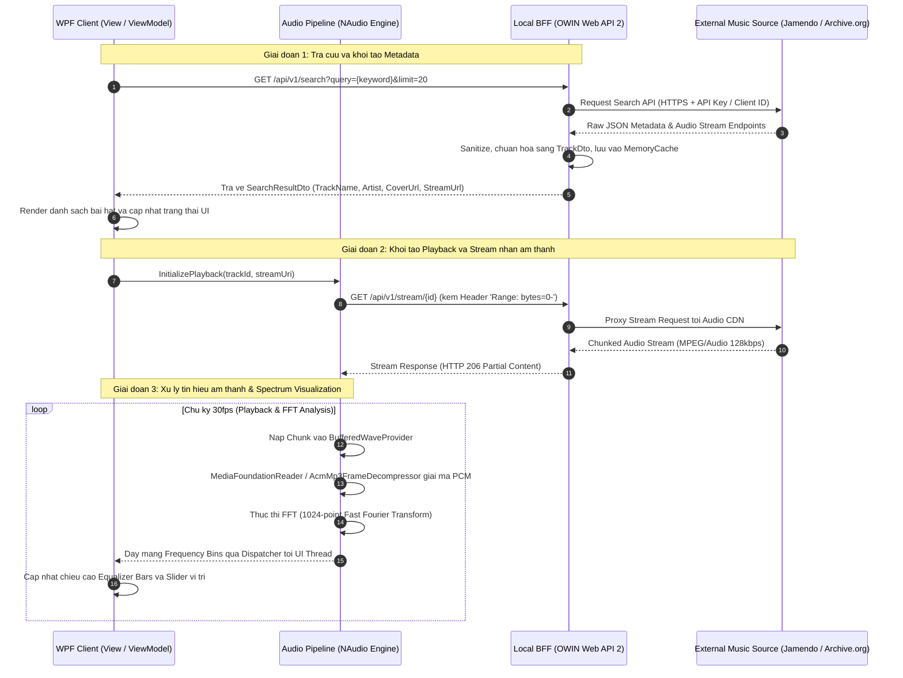
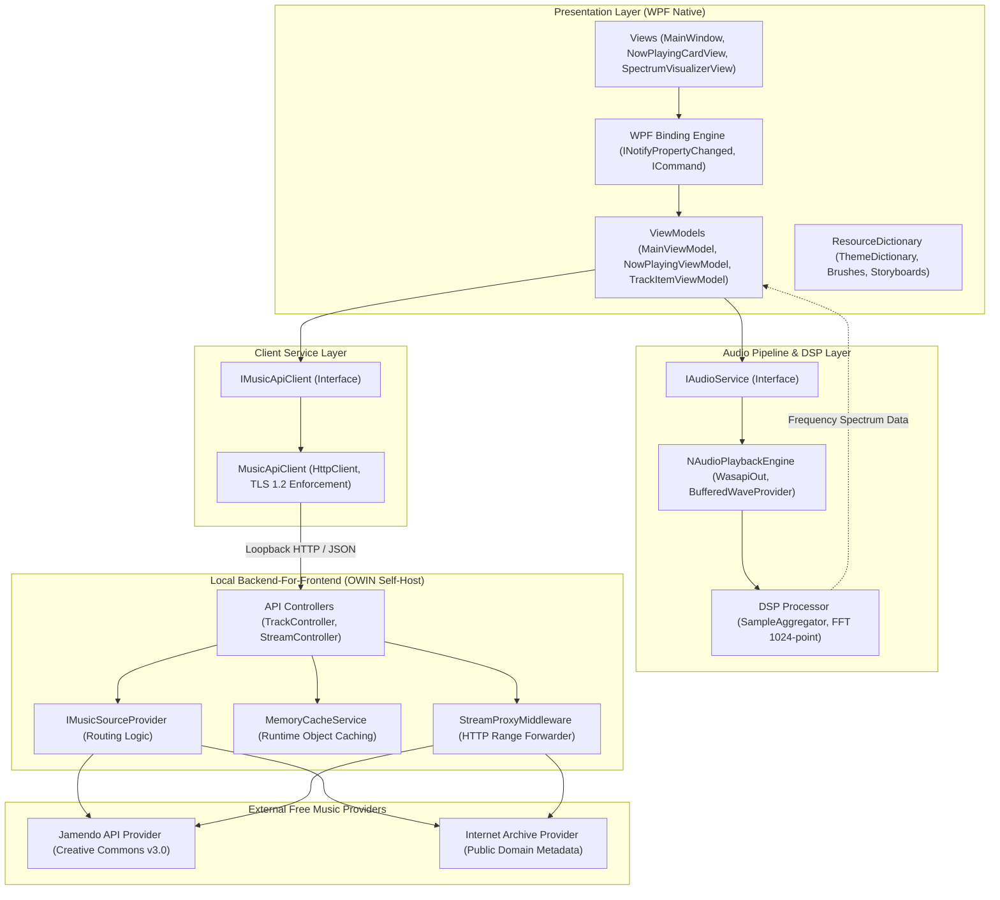

# TÀI LIỆU THIẾT KẾ KỸ THUẬT (TECHNICAL DESIGN DOCUMENT)
## HỆ THỐNG PHÁT NHẠC DESKTOP NATIVE WPF (.NET FRAMEWORK 4.6.1)
**Phiên bản:** 1.0.0  
**Vai trò kiến trúc:** Senior WPF System Architect & Audio Streaming Engineer  
**Nền tảng thực thi:** Windows Presentation Foundation (WPF) / .NET Framework 4.6.1  
**Mô hình kiến trúc:** Model-View-ViewModel (MVVM) kết hợp Local Backend-for-Frontend (BFF) OWIN Self-Host  
**Dự án tham chiếu:** `tthn0/Spotify-Readme` (Flask / HTML5 / CSS3 Animation)  

---

## 1. KIẾN TRÚC & SƠ ĐỒ (ARCHITECTURE & DIAGRAMS)

### 1.1. Sơ đồ luồng dữ liệu (Data Flow Diagram)
Hệ thống sử dụng mô hình Backend-for-Frontend (BFF) chạy cục bộ dưới dạng tiến trình OWIN Self-Host (`http://localhost:5245`). Client WPF không bao giờ giao tiếp trực tiếp với các nhà cung cấp bên ngoài nhằm bảo vệ API Credentials, xử lý rate limiting và chuẩn hóa luồng stream nhị phân trước khi đưa vào Audio Engine.



---

### 1.2. Sơ đồ kiến trúc phân lớp (Layered Architecture Diagram)
Hệ thống được tổ chức phân ranh giới rõ rệt theo các nguyên lý SOLID:



### 1.3. Trách nhiệm chi tiết của các lớp kiến trúc
1. **Presentation Layer (View & ViewModel):**
   - **View:** Khai báo giao diện thuần XAML, cô lập hoàn toàn logic xử lý khỏi Code-Behind. Quản lý việc ánh xạ động `DynamicResource` cho theme (Sáng/Tối) và kích hoạt Storyboard hoạt hình.
   - **ViewModel:** Duy trì trạng thái nghiệp vụ dưới dạng State Machine (`Stopped`, `Buffering`, `Playing`, `Paused`, `Faulted`). Đón nhận dữ liệu tần số từ DSP Processor để phân phối tới UI thông qua cơ chế `ObservableCollection`.
2. **Audio Pipeline & DSP Layer:**
   - **`IAudioService`:** Giao diện trừu tượng hóa toàn bộ vòng đời của engine âm thanh: `Play()`, `Pause()`, `Stop()`, `Seek(TimeSpan)`, `SetVolume(float)`.
   - **`NAudioPlaybackEngine`:** Quản trị luồng âm thanh thông qua Windows Audio Session API (WASAPI) hoặc DirectSound. Cấu hình hàng đợi đệm `BufferedWaveProvider` nhằm triệt tiêu hiện tượng ngắt quãng (jitter) khi streaming qua mạng.
   - **DSP Processor:** Thực thi thuật toán biến đổi Fourier nhanh (Fast Fourier Transform - FFT) trên luồng mẫu PCM để trích xuất biên độ của các dải tần số (Bass, Mid, Treble).
3. **Client Service Layer:**
   - **`IMusicApiClient`:** Hợp đồng dịch vụ mạng phía Client.
   - **`MusicApiClient`:** Quản lý kết nối HTTP loopback với Local BFF thông qua thực thể `HttpClient` tĩnh (Singleton) tuân thủ hướng dẫn tái sử dụng socket của Microsoft.
4. **Local BFF (OWIN Self-Host):**
   - Đóng vai trò lớp cách ly an ninh (Isolation Barrier).
   - Tích hợp bộ nhớ đệm `System.Runtime.Caching.MemoryCache` để lưu trữ siêu dữ liệu bài hát và đường dẫn phân giải âm thanh tạm thời.
   - Xử lý kỹ thuật Stream Proxying: chuyển tiếp các HTTP Chunk kèm theo header `Range: bytes={start}-{end}` cho phép Audio Engine tua bài mượt mà.

---

## 2. CHUYỂN ĐỔI UI/UX (WEB TO WPF MAPPING)

Dự án gốc `tthn0/Spotify-Readme` dựa trên kiến trúc Web-rendered SVG/HTML/CSS tĩnh nhằm phục vụ việc nhúng widget vào GitHub Markdown. Việc chuyển dịch sang WPF đòi hỏi chuyển đổi từ cơ chế DOM & CSS Animation sang WPF Visual Tree & Composition Engine.

### 2.1. Bảng ánh xạ kỹ thuật (Mapping Table)

| Thành phần Web (Repo gốc) | Cơ chế Web (HTML/CSS) | Cơ chế Native WPF (.NET 4.6.1) | Phân tích Rationale & Hiệu năng |
| :--- | :--- | :--- | :--- |
| **Quay đĩa Vinyl** (Album Cover Spin) | `@keyframes spin { 100% { transform: rotate(360deg); } }` | `Storyboard` kết hợp `DoubleAnimation` tác động lên `RotateTransform.Angle` của `Image.RenderTransform`. | WPF Storyboard chạy trên luồng Render (Composition Engine) của DirectX, không gây gián đoạn luồng UI (Dispatcher). Đặt `RenderTransformOrigin="0.5,0.5"`. |
| **Bo tròn đĩa nhạc** (Vinyl Circular Crop) | `border-radius: 50%` | `Image.Clip` sử dụng `EllipseGeometry` có bán kính cố định. | `EllipseGeometry` nhẹ hơn nhiều so với việc dùng `OpacityMask` bằng cọ vẽ `VisualBrush` vốn buộc GPU phải tạo thêm một bộ đệm ngoài màn hình (Off-screen Buffer). |
| **Equalizer Bars (Mô phỏng)** | `@keyframes resize` biến đổi `scaleY(0 -> 1)` với duration ngẫu nhiên | `ItemsControl` chứa danh sách `Rectangle`, mỗi thanh được gán một `DoubleAnimation` độc lập. | Thích hợp cho chế độ tiết kiệm năng lượng (Low-power mode), không tiêu hao chu kỳ CPU để phân tích âm thanh. |
| **Equalizer Bars (Phổ thực tế)** | Không hỗ trợ (Web SVG chỉ giả lập) | Thu thập mẫu PCM từ NAudio, tính toán 1024-point FFT, phân cụm vào 16 bins tần số và đồng bộ lên `ObservableCollection<double>`. | Mang lại phản hồi đồ họa chính xác theo nhịp trống và giọng hát thực tế của bản nhạc. |
| **Hiệu ứng cầu vồng** (Rainbow Color) | `@keyframes rainbow { 100% { filter: hue-rotate(360deg); } }` | `ColorAnimationUsingKeyFrames` áp dụng lên `SolidColorBrush.Color` hoặc dùng `LinearGradientBrush`. | .NET Framework 4.6.1 không có bộ lọc `hue-rotate` có sẵn trong WPF. Dùng `ColorAnimation` tránh phải viết và nhúng mã đổ bóng điểm ảnh HLSL (PixelShader Effect). |
| **Đổi chủ đề** (Dark / Light Theme) | Template Jinja2 tiêm trực tiếp mã màu HEX vào SVG: `{{ background_color }}` | `ResourceDictionary` động (`DynamicResource`). Chuyển đổi qua lại bằng cách thay thế từ điển tài nguyên trong `Application.Current.Resources.MergedDictionaries`. | Cập nhật toàn bộ visual tree ngay lập tức trong thời gian chạy mà không cần tải lại cửa sổ. |
| **Cắt ngắn tiêu đề** (Text Truncation) | `text-overflow: ellipsis; white-space: nowrap; overflow: hidden;` | `TextBlock.TextTrimming="CharacterEllipsis"` kết hợp `MaxWidth` ràng buộc. | Cơ chế đo lường văn bản bản địa của DirectWrite giúp hiển thị dấu ba chấm chuẩn xác theo kích thước font. |
| **Mã vạch bài hát** (Spotify Code) | `transform: rotate(270deg) translateY(-120px);` | `Image.LayoutTransform` với `RotateTransform Angle="270"`. | Dùng `LayoutTransform` thay vì `RenderTransform` để hệ số đo lường kích thước (Measure/Arrange) của container cha tính toán lại chuẩn xác không gian chiếm dụng. |

---

### 2.2. Skeleton XAML: Now Playing Card (`NowPlayingCardView.xaml`)

```xml
<UserControl x:Class="SpotifyWpf.Client.Views.NowPlayingCardView"
             xmlns="http://schemas.microsoft.com/winfx/2006/xaml/presentation"
             xmlns:x="http://schemas.microsoft.com/winfx/2006/xaml"
             xmlns:mc="http://schemas.openxmlformats.org/markup-compatibility/2006" 
             xmlns:d="http://schemas.microsoft.com/expression/blend/2008"
             mc:Ignorable="d" 
             d:DesignHeight="160" d:DesignWidth="495">

    <UserControl.Resources>
        <!-- Storyboard quay dia Vinyl vo han: Chi kich hoat khi PlaybackState == Playing -->
        <Storyboard x:Key="VinylSpinStoryboard">
            <DoubleAnimation Storyboard.TargetName="AlbumCoverRotateTransform"
                             Storyboard.TargetProperty="Angle"
                             From="0" To="360"
                             Duration="0:0:10"
                             RepeatBehavior="Forever" />
        </Storyboard>
    </UserControl.Resources>

    <!-- The chua su dung DynamicResource de dap ung che do Sang/Toi -->
    <Border Background="{DynamicResource CardBackgroundBrush}"
            CornerRadius="8"
            Padding="16">
        <Border.Effect>
            <DropShadowEffect BlurRadius="18" 
                              ShadowDepth="2" 
                              Direction="270" 
                              Opacity="0.35" 
                              Color="{DynamicResource CardShadowColor}" />
        </Border.Effect>

        <Grid>
            <Grid.ColumnDefinitions>
                <ColumnDefinition Width="Auto" />
                <ColumnDefinition Width="*" />
            </Grid.ColumnDefinitions>

            <!-- Khung dia hat Vinyl co the xoay -->
            <Grid Grid.Column="0" Width="120" Height="120" HorizontalAlignment="Center" VerticalAlignment="Center">
                <Image Source="{Binding CurrentTrack.AlbumArtUrl, TargetNullValue={x:Null}}"
                       Stretch="UniformToFill"
                       RenderTransformOrigin="0.5,0.5">
                    <!-- Cat anh thanh hinh tron tuong duong border-radius: 50% tren Web -->
                    <Image.Clip>
                        <EllipseGeometry Center="60,60" RadiusX="60" RadiusY="60" />
                    </Image.Clip>
                    
                    <Image.RenderTransform>
                        <RotateTransform x:Name="AlbumCoverRotateTransform" Angle="0" />
                    </Image.RenderTransform>
                </Image>
            </Grid>

            <!-- Khu vuc thong tin ban nhac va pho tan so -->
            <Grid Grid.Column="1" Margin="16,0,0,0">
                <Grid.RowDefinitions>
                    <RowDefinition Height="Auto" />
                    <RowDefinition Height="Auto" />
                    <RowDefinition Height="*" />
                    <RowDefinition Height="Auto" />
                </Grid.RowDefinitions>

                <!-- Ten ca khuc -->
                <TextBlock Grid.Row="0"
                           Text="{Binding CurrentTrack.Title, FallbackValue='No Track Selected'}"
                           FontSize="18"
                           FontWeight="Bold"
                           Foreground="{DynamicResource TitleForegroundBrush}"
                           TextTrimming="CharacterEllipsis"
                           MaxWidth="280"
                           HorizontalAlignment="Left" />

                <!-- Ten nghe si -->
                <TextBlock Grid.Row="1"
                           Text="{Binding CurrentTrack.Artist, FallbackValue='Unknown Artist'}"
                           FontSize="14"
                           FontWeight="Medium"
                           Foreground="{DynamicResource SubtitleForegroundBrush}"
                           TextTrimming="CharacterEllipsis"
                           Margin="0,4,0,0"
                           MaxWidth="280"
                           HorizontalAlignment="Left" />

                <!-- Khu vuc hien thi cac cot Equalizer Spectrum -->
                <ItemsControl Grid.Row="2"
                              ItemsSource="{Binding EqualizerBins}"
                              VerticalAlignment="Bottom"
                              Margin="0,8,0,8"
                              Height="35">
                    <ItemsControl.ItemsPanel>
                        <ItemsPanelTemplate>
                            <StackPanel Orientation="Horizontal" VerticalAlignment="Bottom" />
                        </ItemsPanelTemplate>
                    </ItemsControl.ItemsPanel>
                    <ItemsControl.ItemTemplate>
                        <DataTemplate>
                            <Rectangle Width="6"
                                       Height="{Binding Path=.}"
                                       Margin="2,0"
                                       RadiusX="2" RadiusY="2"
                                       Fill="{DynamicResource AccentBrandBrush}"
                                       VerticalAlignment="Bottom" />
                        </DataTemplate>
                    </ItemsControl.ItemTemplate>
                </ItemsControl>

                <!-- Thanh dieu huong thoi gian phat (Timeline Slider) -->
                <Grid Grid.Row="3">
                    <Grid.ColumnDefinitions>
                        <ColumnDefinition Width="Auto" />
                        <ColumnDefinition Width="*" />
                        <ColumnDefinition Width="Auto" />
                    </Grid.ColumnDefinitions>

                    <TextBlock Grid.Column="0" 
                               Text="{Binding FormattedPosition, FallbackValue='00:00'}" 
                               FontSize="11" 
                               Foreground="{DynamicResource SubtitleForegroundBrush}" />

                    <Slider Grid.Column="1" 
                            Margin="8,0"
                            Minimum="0" 
                            Maximum="{Binding TrackDurationSeconds}" 
                            Value="{Binding CurrentPositionSeconds, Mode=TwoWay}"
                            IsMoveToPointEnabled="True" />

                    <TextBlock Grid.Column="2" 
                               Text="{Binding FormattedDuration, FallbackValue='00:00'}" 
                               FontSize="11" 
                               Foreground="{DynamicResource SubtitleForegroundBrush}" />
                </Grid>
            </Grid>
        </Grid>
    </Border>
</UserControl>
```

---

## 3. QUY TRÌNH TRIỂN KHAI (IMPLEMENTATION PIPELINE)

### 3.1. Bước 1: Cấu trúc Solution (.NET Framework 4.6.1)
Mã nguồn được cấu trúc hóa theo 4 dự án con để đảm bảo ranh giới cô lập (Boundary Isolation):

```text
SpotifyWpf.sln
├── src/
│   ├── SpotifyWpf.Core/             [.NET Framework 4.6.1 Class Library]
│   │   ├── Models/                  (TrackModel, PlaybackState, AudioStreamDescriptor)
│   │   ├── Dtos/                    (SearchRequestDto, SearchResponseDto, TrackDto)
│   │   ├── Interfaces/              (IAudioService, IMusicApiClient, IMusicSourceProvider)
│   │   └── Common/                  (ObservableObject, RelayCommand, AsyncCommand)
│   │
│   ├── SpotifyWpf.Bff/              [.NET Framework 4.6.1 Console / Windows Service]
│   │   ├── Startup.cs               (OWIN HttpConfiguration, Autofac IoC, Web API Routing)
│   │   ├── Controllers/             (TrackController, StreamController)
│   │   ├── Providers/               (JamendoSourceProvider, ArchiveOrgSourceProvider)
│   │   ├── Middlewares/             (RangeStreamProxyMiddleware)
│   │   └── Services/                (MemoryCacheService)
│   │
│   ├── SpotifyWpf.AudioEngine/      [.NET Framework 4.6.1 Class Library]
│   │   ├── NAudioService.cs         (WasapiOut, MediaFoundationReader, Volume/Seek control)
│   │   ├── Stream/                  (BufferedHttpWaveStream, ChunkDownloadManager)
│   │   └── Dsp/                     (SampleAggregator, FftCalculator)
│   │
│   └── SpotifyWpf.Client/           [.NET Framework 4.6.1 WPF Application]
│       ├── App.xaml / App.xaml.cs   (Global Exception Handling, TLS 1.2 Setup, DI Bootstrap)
│       ├── Resources/               (Themes/DarkTheme.xaml, Themes/LightTheme.xaml)
│       ├── ViewModels/              (MainViewModel, NowPlayingViewModel, SearchViewModel)
│       ├── Views/                   (MainWindow.xaml, NowPlayingCardView.xaml)
│       └── Converters/              (SecondsToTimeSpanConverter, PlaybackStateToVisibilityConverter)
└── tests/
    └── SpotifyWpf.Tests/            (Unit Tests cho ViewModel va BFF Controller)
```

---

### 3.2. Bước 2: Thiết kế Hợp đồng / Giao diện cho Local API (BFF)
Local BFF cung cấp RESTful API cục bộ tại `http://localhost:5245/api/v1`.

#### Endpoint 1: Tìm kiếm bài hát
- **Phương thức:** `GET /api/v1/search`
- **Tham số truy vấn:**
  - `query` (string, bắt buộc): Chuỗi từ khóa tìm kiếm.
  - `limit` (int, tùy chọn, mặc định: 20): Số lượng bản ghi trên một trang.
  - `page` (int, tùy chọn, mặc định: 1): Số thứ tự trang kết quả.
- **Mã phản hồi HTTP:** `200 OK`, `400 Bad Request`, `502 Bad Gateway`.
- **Cấu trúc dữ liệu JSON trả về:**
```json
{
  "total": 48,
  "page": 1,
  "pageSize": 20,
  "items": [
    {
      "id": "jamendo_track_1849201",
      "title": "Neon Skyline",
      "artist": "Synthwave Collective",
      "album": "Retro Horizons",
      "durationSeconds": 242,
      "coverImageUrl": "https://usercontent.jamendo.com?type=album&id=1849&width=300",
      "streamEndpoint": "/api/v1/stream/jamendo_track_1849201",
      "license": "CC BY-NC 4.0"
    }
  ]
}
```

#### Endpoint 2: Truy xuất luồng âm thanh (Audio Stream)
- **Phương thức:** `GET /api/v1/stream/{id}`
- **Header hỗ trợ:** `Range: bytes={start}-{end}`.
- **Cơ chế xử lý:**
  - Khi NAudio gửi `Range: bytes=0-1048575` (tải trước 1MB đầu tiên), BFF chuyển tiếp header này tới máy chủ nguồn.
  - Phản hồi trả về đạt mã `HTTP 206 Partial Content` kèm `Content-Range: bytes 0-1048575/4298102` và `Content-Type: audio/mpeg`.
  - Cơ chế này cho phép người dùng nhảy tới bất kỳ giây nào trong bài hát mà không phải tải toàn bộ tập tin âm thanh về máy.

---

### 3.3. Bước 3: Triển khai Trạng thái Playback trong WPF ViewModel

Hệ thống quản lý trạng thái phát nhạc bằng mô hình máy trạng thái hữu hạn (Finite State Machine - FSM):

```csharp
namespace SpotifyWpf.Core.Models
{
    public enum PlaybackState
    {
        Stopped,
        Buffering,
        Playing,
        Paused,
        Faulted
    }
}
```

Mã khung xử lý đồng bộ hóa trạng thái trong ViewModel:
```csharp
private PlaybackState _playbackState = PlaybackState.Stopped;
public PlaybackState PlaybackState
{
    get { return _playbackState; }
    set
    {
        if (SetProperty(ref _playbackState, value))
        {
            // Cap nhat kha nang thuc thi cua cac nut bam dieu khien tren giao dien
            PlayCommand.RaiseCanExecuteChanged();
            PauseCommand.RaiseCanExecuteChanged();
            
            // Xac dinh trang thai quay dia va hien thi pho tan so am thanh
            OnPropertyChanged(nameof(IsVisualizerActive));
            OnPropertyChanged(nameof(CanSeek));
        }
    }
}

public bool IsVisualizerActive => PlaybackState == PlaybackState.Playing;
public bool CanSeek => PlaybackState == PlaybackState.Playing || PlaybackState == PlaybackState.Paused;
```

---

### 3.4. Bước 4: So sánh và Lựa chọn Audio Playback Engine

| Tiêu chuẩn so sánh | `System.Windows.Controls.MediaElement` | `NAudio` (v1.10.0 / v2.x cho .NET 4.6.1) |
| :--- | :--- | :--- |
| **Bản chất kiến trúc** | Bao bọc quanh Windows Media Player ActiveX / DirectShow Graph cũ. | Tương tác trực tiếp với Windows Audio Session API (WASAPI) và WaveOut bản địa. |
| **Khả năng Stream mạng** | Hoạt động dạng hộp đen (Blackbox). Dễ bị treo hoặc đơ giao diện khi mạng chập chờn. | Quản lý độc lập bằng `BufferedWaveProvider`. Chủ động kiểm soát ngưỡng tải trước (Pre-buffer threshold). |
| **Phân tích phổ (FFT)** | **Không thể thực hiện**. Không có cơ chế can thiệp lấy mảng byte PCM thô. | **Tích hợp sâu**. Cung cấp bộ giải thuật `FastFourierTransform.FFT` trên luồng mẫu âm thanh thời gian thực. |
| **Quản trị bộ nhớ** | **Rủi ro rò rỉ rất cao**. Lỗi unmanaged leak tồn đọng lâu năm của WPF nếu không giải phóng thủ công. | Tuân thủ tuyệt đối quy ước `IDisposable`. Dễ dàng thu hồi buffer và handle thiết bị. |
| **Khả năng tua (Seeking)** | Chậm và phụ thuộc vào việc tệp đã tải xong hay chưa. | Phối hợp hoàn hảo với HTTP Range Request, nhảy mốc thời gian tức thì. |

**Quyết định kiến trúc:** Bắt buộc sử dụng **NAudio**. `MediaElement` không đáp ứng được yêu cầu về phân tích phổ tần số và tiềm ẩn rủi ro rò rỉ bộ nhớ unmanaged nghiêm trọng trên .NET 4.6.1.

---

## 4. MÃ NGUỒN THỰC TIỄN (PRACTICAL CODE SNIPPETS)

### 4.1. Lớp cơ sở ViewModel (`ObservableObject.cs`)
Triển khai mẫu thiết kế `INotifyPropertyChanged` chuẩn mực trên C# 6 / .NET Framework 4.6.1 với thuộc tính `[CallerMemberName]`:

```csharp
using System;
using System.ComponentModel;
using System.Runtime.CompilerServices;

namespace SpotifyWpf.Core.Common
{
    /// <summary>
    /// Lop co so truyen thong diep thay doi du lieu toi WPF Binding Engine.
    /// </summary>
    public abstract class ObservableObject : INotifyPropertyChanged
    {
        public event PropertyChangedEventHandler PropertyChanged;

        /// <summary>
        /// Cap nhat gia tri bien noi tai va tu dong thong bao qua CallerMemberName.
        /// </summary>
        protected virtual bool SetProperty<T>(ref T storage, T value, [CallerMemberName] string propertyName = null)
        {
            // Tranh phat sinh su kien du thua neu gia tri moi trung khop gia tri cu
            if (Equals(storage, value))
            {
                return false;
            }

            storage = value;
            OnPropertyChanged(propertyName);
            return true;
        }

        /// <summary>
        /// Kich hoat su kien PropertyChanged theo cach thuc an toan luong.
        /// </summary>
        protected virtual void OnPropertyChanged([CallerMemberName] string propertyName = null)
        {
            PropertyChanged?.Invoke(this, new PropertyChangedEventArgs(propertyName));
        }
    }
}
```

---

### 4.2. Lớp triển khai Lệnh tương tác (`RelayCommand.cs`)

```csharp
using System;
using System.Windows.Input;

namespace SpotifyWpf.Core.Common
{
    /// <summary>
    /// Dinh tuyen hanh dong tu View toi cac phuong thuc thuc thi trong ViewModel.
    /// </summary>
    public class RelayCommand : ICommand
    {
        private readonly Action<object> _execute;
        private readonly Predicate<object> _canExecute;

        public RelayCommand(Action<object> execute, Predicate<object> canExecute = null)
        {
            _execute = execute ?? throw new ArgumentNullException(nameof(execute));
            _canExecute = canExecute;
        }

        public bool CanExecute(object parameter)
        {
            return _canExecute == null || _canExecute(parameter);
        }

        public void Execute(object parameter)
        {
            _execute(parameter);
        }

        /// <summary>
        /// Yeu cau WPF danh gia lai dieu kien CanExecute tren toan bo cay Visual Tree.
        /// </summary>
        public void RaiseCanExecuteChanged()
        {
            CommandManager.InvalidateRequerySuggested();
        }

        public event EventHandler CanExecuteChanged
        {
            add { CommandManager.RequerySuggested += value; }
            remove { CommandManager.RequerySuggested -= value; }
        }
    }
}
```

---

### 4.3. Dịch vụ gọi API tích hợp cơ chế bảo vệ TLS 1.2 (`MusicApiClient.cs`)
Trên .NET Framework 4.6.1, giao thức SSL 3.0 và TLS 1.0 là mặc định cũ. Cần phải kích hoạt minh thị TLS 1.2 ở mức tầng tiến trình trước khi tạo yêu cầu mạng đầu tiên.

```csharp
using System;
using System.Net;
using System.Net.Http;
using System.Net.Http.Headers;
using System.Threading;
using System.Threading.Tasks;

namespace SpotifyWpf.Client.Services
{
    /// <summary>
    /// Dich vu ket noi mang toi Local BFF. Su dung Singleton HttpClient de tranh socket exhaustion.
    /// </summary>
    public class MusicApiClient : IDisposable
    {
        private static readonly HttpClient _httpClient;
        private readonly string _baseUrl;

        static MusicApiClient()
        {
            // Ly do kien truc: .NET Framework 4.6.1 mac dinh khong bat TLS 1.2.
            // Doan ma nay bat buoc phai chay tai static constructor truoc khi co bat ky ket noi mang nao.
            ServicePointManager.SecurityProtocol |= SecurityProtocolType.Tls12 | SecurityProtocolType.Tls11;

            // Tang han muc socket dong thoi cho moi Host nham phuc vu viec stream am thanh chunked
            ServicePointManager.DefaultConnectionLimit = 64;

            var handler = new HttpClientHandler
            {
                // Giam dung luong JSON truyen tai bang cach tu dong giai nen o cap ha tang
                AutomaticDecompression = DecompressionMethods.GZip | DecompressionMethods.Deflate
            };

            _httpClient = new HttpClient(handler)
            {
                Timeout = TimeSpan.FromSeconds(15)
            };

            _httpClient.DefaultRequestHeaders.Accept.Clear();
            _httpClient.DefaultRequestHeaders.Accept.Add(new MediaTypeWithQualityHeaderValue("application/json"));
            _httpClient.DefaultRequestHeaders.Add("User-Agent", "SpotifyWpfClient/1.0 (.NET Framework 4.6.1)");
        }

        public MusicApiClient(string baseUrl = "http://localhost:5245/api/v1")
        {
            _baseUrl = baseUrl.TrimEnd('/');
        }

        /// <summary>
        /// Gui yeu cau tim kiem bat dong bo kem theo co che huy bo khi nguoi dung go phim lien tuc.
        /// </summary>
        public async Task<string> SearchTracksRawAsync(string query, int limit, CancellationToken cancellationToken)
        {
            if (string.IsNullOrWhiteSpace(query))
            {
                return string.Empty;
            }

            string requestUri = $"{_baseUrl}/search?query={Uri.EscapeDataString(query)}&limit={limit}";

            try
            {
                // Su dung ResponseHeadersRead de tranh viec buffer toan bo payload vao bo nho RAM truoc
                using (HttpResponseMessage response = await _httpClient.GetAsync(requestUri, HttpCompletionOption.ResponseHeadersRead, cancellationToken).ConfigureAwait(false))
                {
                    response.EnsureSuccessStatusCode();
                    return await response.Content.ReadAsStringAsync().ConfigureAwait(false);
                }
            }
            catch (OperationCanceledException)
            {
                // Request chu dong bi huy bo boi CancellationToken, tra ve null ma khong xem la loi he thong
                return null;
            }
            catch (HttpRequestException httpEx)
            {
                // Dong goi lai exception he thong thanh loi nghiep vu ro rang
                throw new ApplicationException($"Khong the ket noi toi Local BFF tai dia chi: {requestUri}", httpEx);
            }
        }

        public void Dispose()
        {
            // Khong dispose _httpClient static de duy tri connection pool trong suot vong doi ung dung
        }
    }
}
```

---

## 5. PHẢN BIỆN & PHÂN TÍCH RỦI RO (CRITIQUE & PITFALLS)

### 5.1. Rủi ro kỹ thuật đặc thù của .NET Framework 4.6.1

1. **Rủi ro bắt tay SSL/TLS 1.2 trên các bản cài Windows cũ (Windows 7 / 8.1):**
   - **Bối cảnh:** Dù mã nguồn đã thiết lập `ServicePointManager.SecurityProtocol = SecurityProtocolType.Tls12`, trên một số bản cài đặt Windows 7 SP1 hoặc máy trạm chưa cập nhật bản vá bảo mật, hệ điều hành thiếu các bộ mã hóa (Cipher Suites) hiện đại như ECDHE-RSA-AES128-GCM-SHA256 mà các CDN âm thanh yêu cầu.
   - **Hậu quả:** Xuất hiện lỗi bất ngờ: `The request was aborted: Could not create SSL/TLS secure channel`.
   - **Chiến lược giảm thiểu (Mitigation):**
     - Đặt cơ chế kiểm tra và bật cờ Registry `SchUseStrongCrypto` tại đường dẫn `HKLM\SOFTWARE\Microsoft\.NETFramework\v4.0.30319` trong trình cài đặt (Installer/MSI).
     - Phân định ranh giới: Client WPF hoàn toàn giao tiếp qua giao thức `http://localhost` thuần túy với Local BFF. Toàn bộ logic đàm phán SSL/TLS ra Internet được cô lập trong tiến trình BFF, giúp khoanh vùng kiểm soát lỗi.

2. **Rò rỉ bộ nhớ (Memory Leak) và phân mảnh Large Object Heap (LOH):**
   - **Bối cảnh:** .NET 4.6.1 chưa được trang bị `Span<T>`, `Memory<T>` hay `ArrayPool<T>`. Mỗi giây phân tích âm thanh, hệ thống cần cấp phát mảng float/byte để xử lý FFT. Nếu cấp phát liên tục trên 85,000 bytes, dữ liệu sẽ bị đẩy thẳng vào LOH và không bao giờ được dọn dẹp thường xuyên. Ngoài ra, việc gán trực tiếp URL vào `BitmapImage` của WPF sẽ làm rò rỉ bộ nhớ unmanaged nếu không đóng luồng.
   - **Hậu quả:** Ứng dụng tăng dung lượng chiếm dụng RAM từ 80MB lên tới 600MB+ chỉ sau 1 giờ nghe nhạc liên tục; GC kích hoạt Full Gen 2 gây đứng hình giao diện.
   - **Chiến lược giảm thiểu (Mitigation):**
     - Sử dụng bộ đệm tĩnh cố định (Pre-allocated Static Ring Buffer) cho các khối dữ liệu FFT trong lớp `DspProcessor`. Không bao giờ tạo mảng `new byte[]` hay `new float[]` bên trong vòng lặp phân tích âm thanh.
     - Với hình ảnh album: Tải luồng byte thủ công, nạp vào `BitmapImage`, gọi bắt buộc lệnh `bitmap.Freeze()` trước khi gán vào ViewModel. Thao tác này biến đối tượng bitmap thành bất biến (Immutable) và giải phóng các handle unmanaged.

3. **Hiện tượng giật lag luồng UI (UI Thread Stuttering) do quá tải Dispatcher:**
   - **Bối cảnh:** Hiệu ứng Equalizer nếu cập nhật 60 lần mỗi giây qua `Dispatcher.InvokeAsync` sẽ làm tắc nghẽn hàng đợi thông điệp giao diện của Windows (Win32 Message Queue).
   - **Hậu quả:** Con trỏ chuột bị giật, thao tác kéo thả slider bị khựng.
   - **Chiến lược giảm thiểu (Mitigation):**
     - Áp dụng kỹ thuật Tiết lưu (Throttling): Giới hạn tần suất đẩy dữ liệu đồ thị phổ lên UI ở mức tối đa 25-30fps thông qua việc kiểm tra khoảng thời gian trôi qua (`Stopwatch.ElapsedMilliseconds >= 33ms`).
     - Tận dụng Storyboard thuần cho hiệu ứng quay đĩa vinyl (vốn chạy trên luồng Render của DirectX), tách biệt hoàn toàn khỏi luồng logic của ứng dụng.

---

### 5.2. Rủi ro pháp lý & kỹ thuật của "Nguồn nhạc miễn phí" (Free Music Sources)

1. **Rủi ro Pháp lý, Bản quyền và Giấy phép Creative Commons:**
   - **Vấn đề:** Các nguồn như Internet Archive chứa lượng lớn dữ liệu do cộng đồng đăng tải, trong đó có nhiều bản ghi vi phạm bản quyền thương mại chưa được kiểm duyệt. Nếu ứng dụng lập chỉ mục và phát trực tiếp các bản ghi này, nhà phát triển có nguy cơ vi phạm Đạo luật Bản quyền Thiên niên kỷ Kỹ thuật số (DMCA Takedown).
   - **Chiến lược giảm thiểu (Mitigation):**
     - Đặt **Jamendo API** làm nguồn dữ liệu chính thống bậc một. Jamendo cung cấp metadata rõ ràng về giấy phép phân phối phi thương mại (Creative Commons: CC BY-NC-ND / CC BY-SA).
     - Ràng buộc cấu trúc `TrackDto` phải hiển thị rõ ràng thông tin giấy phép bản quyền trên giao diện người dùng kèm theo liên kết xác minh nguồn gốc.

2. **Rủi ro Giới hạn Tần suất Truy cập (API Quota & Rate Limiting):**
   - **Vấn đề:** Các API công cộng thường áp dụng hạn mức nghiêm ngặt (ví dụ: Jamendo giới hạn 100 requests/phút trên mỗi Client ID). Nếu người dùng gõ tìm kiếm liên tục, hệ thống sẽ lập tức trả về mã lỗi `HTTP 429 Too Many Requests`.
   - **Chiến lược giảm thiểu (Mitigation):**
     - **Debouncing:** Phía WPF Client thiết lập thời gian trễ 400ms sau ký tự gõ cuối cùng trước khi kích hoạt lệnh tìm kiếm qua `CancellationTokenSource`.
     - **Local Caching:** Local BFF lưu trữ kết quả tìm kiếm vào `MemoryCache` trong 30 phút. Các truy vấn trùng lặp được phục vụ trực tiếp từ bộ nhớ RAM nội bộ mà không tạo ra bất kỳ request mạng nào ra ngoài.

3. **Rủi ro Đứt gãy luồng phát và Không hỗ trợ HTTP Range:**
   - **Vấn đề:** Nhiều máy chủ lưu trữ miễn phí không hỗ trợ CDN chất lượng cao hoặc từ chối hỗ trợ tiêu đề `Range: bytes=...`. Khi người dùng thực hiện tua bài, NAudio sẽ bị ngắt kết nối do không thể đọc dữ liệu tại vị trí offset mong muốn.
   - **Chiến lược giảm thiểu (Mitigation):**
     - **Fallback Local Cache Streaming:** Trong BFF, nếu máy chủ nguồn trả về `HTTP 200 OK` thay vì `206 Partial Content` khi nhận được Range Header, tiến trình BFF sẽ tự động kích hoạt chế độ Background Download về một tệp tạm (`.tmp`) trong thư mục cục bộ của máy tính và tự mình đóng vai trò HTTP Range Server phục vụ cho NAudio.
     - **Cơ chế Tự động Kết nối lại (Auto-reconnect Pipeline):** NAudioService được bọc trong một bộ giám sát trạng thái đệm. Nếu luồng stream bị ngắt giữa chừng, engine sẽ tự động gửi yêu cầu Range mới từ đúng vị trí byte đã ngắt để tiếp tục phát mà không buộc người dùng phải nghe lại từ đầu.

