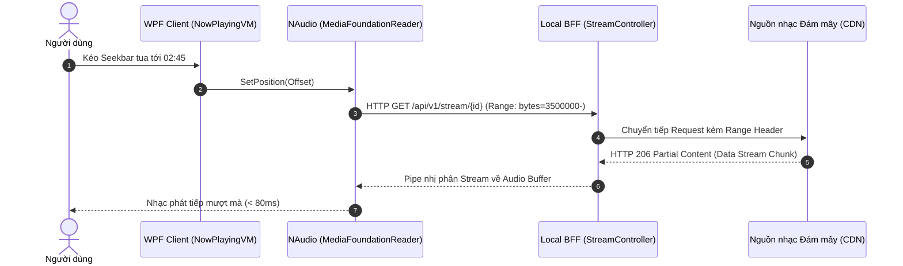

# KỊCH BẢN THUYẾT TRÌNH BẢO VỆ ĐỒ ÁN: MUSICAPP DESKTOP
## HỆ THỐNG PHÁT NHẠC DESKTOP NATIVE WPF (.NET FRAMEWORK 4.6.1) VỚI KIẾN TRÚC MODULAR MONOLITH, LOCAL BFF OWIN, AUDIO ENGINE DSP & SQLITE WAL PERSISTENCE

---

## THÔNG TIN TỔNG QUAN BÀI THUYẾT TRÌNH
- **Đề tài:** Xây dựng ứng dụng phát nhạc Desktop Native trên nền tảng WPF (.NET Framework 4.6.1)
- **Học phần / Môn học:** Lập trình ứng dụng .NET / Đồ án Chuyên ngành Công nghệ Phần mềm
- **Sinh viên thực hiện:** NotJimmy97 (`musicappbyNT`)
- **Thời lượng thuyết trình tiêu chuẩn:** 15 – 20 phút (bao gồm Demo và Hỏi - Đáp)
- **Tổng số Slide:** 13 Slide (Cấu trúc tối ưu cho Hội đồng Đồ án Kỹ thuật)
- **Công cụ trình chiếu khuyến nghị:** Microsoft PowerPoint / Marp for VS Code / Slidev / HTML Deck

---

## MỤC LỤC DANH MỤC CÁC SLIDE
1. **Slide 1:** Tiêu đề & Giới thiệu Đề tài (Title & Introduction)
2. **Slide 2:** Bối cảnh, Lý do Chọn Đề tài & Thách thức Kỹ thuật (Problem Statement & Motivation)
3. **Slide 3:** Khảo sát Nghiệp vụ & Ma trận Yêu cầu Hệ thống (System Requirements Matrix)
4. **Slide 4:** Kiến trúc Tổng thể Hệ thống: Modular Monolith & MVVM (High-Level Architecture)
5. **Slide 5:** Trạm Dịch vụ Cục bộ Local BFF OWIN & HTTP 206 Streaming Proxy (Local BFF Engine)
6. **Slide 6:** Engine Xử lý Âm thanh DSP & 10-Band Graphic Equalizer (Audio DSP Pipeline)
7. **Slide 7:** Phân tích Phổ Âm thanh FFT & Hiệu ứng Trực quan Đĩa Than (FFT Visualizer & Animation)
8. **Slide 8:** Tầng Lưu trữ Dữ liệu Bền vững: CSDL SQLite Chế độ WAL (Persistence Layer)
9. **Slide 9:** Động cơ Gợi ý Cá nhân hóa & Thuật toán Smart Shuffle (Boltzmann Sampling)
10. **Slide 10:** Phân hệ Ngoại tuyến: Quét BFS Thư viện Cục bộ, Hàng đợi Kéo thả & Karaoke Lyrics
11. **Slide 11:** Quá trình Xây dựng, Tiến độ Thực hiện & Quản trị Rủi ro (Development Journey)
12. **Slide 12:** Kiểm thử Phần mềm Tự động & Đánh giá Kết quả Thực nghiệm (Testing & Benchmarks)
13. **Slide 13:** Tổng kết Đề tài, Hướng Phát triển & Hỏi - Đáp Phản biện (Conclusion, Roadmap & Q&A)

---

<!-- ========================================================================= -->
<!-- SLIDE 1 -->
<!-- ========================================================================= -->

## SLIDE 1: TIÊU ĐỀ & GIỚI THIỆU ĐỀ TÀI (TITLE & INTRODUCTION)

### 1. Nội dung hiển thị trên Slide
- **Tên đề tài chính:**
  # XÂY DỰNG ỨNG DỤNG PHÁT NHẠC DESKTOP NATIVE TRÊN NỀN TẢNG WPF (.NET FRAMEWORK 4.6.1)
- **Phụ đề chuyên môn:**
  *Kiến trúc Modular Monolith kết hợp Trạm dịch vụ cục bộ Local BFF OWIN, Audio Engine DSP 10-Band Equalizer và Tầng lưu trữ SQLite WAL*
- **Thông tin học thuật:**
  - **Môn học:** Lập trình ứng dụng .NET
  - **Sinh viên thực hiện:** Nhóm tác giả `musicappbyNT`
  - **Giảng viên hướng dẫn:** [Tên Thầy / Cô hướng dẫn]
- **Tuyên ngôn sản phẩm (Product Vision):**
  > *"Hiện thực hóa trải nghiệm nghe nhạc chuẩn mực của Spotify ngay trên môi trường Windows Desktop: Khởi động tức thì, tiêu thụ bộ nhớ tối thiểu, độ trễ âm thanh bằng không và vận hành bền bỉ cả khi không có kết nối Internet."*
- **Hệ sinh thái công nghệ chủ đạo (Badges):**
  `C# 7.3` | `.NET Framework 4.6.1` | `WPF Native XAML` | `OWIN Self-Host` | `NAudio DSP` | `SQLite WAL` | `MSTest v2`

---

### 2. Lời thoại thuyết minh của sinh viên (Presenter Script)
> *"Kính thưa Quý Thầy/Cô trong Hội đồng và các bạn sinh viên,*
>
> *Hôm nay, em xin đại diện nhóm thực hiện đề tài báo cáo về đồ án: **'Xây dựng ứng dụng phát nhạc Desktop Native trên nền tảng WPF (.NET Framework 4.6.1)'**.*
>
> *Trong đồ án này, mục tiêu trọng tâm của chúng em không chỉ dừng lại ở việc tạo ra một giao diện nghe nhạc đơn thuần, mà là nghiên cứu và hiện thực hóa một kiến trúc phần mềm chuẩn mực cho ứng dụng máy tính cá nhân. Bằng cách kết hợp mô hình MVVM thuần túy của WPF, kiến trúc trạm trung gian cục bộ Local BFF chạy trên máy chủ OWIN Self-Host, chuỗi xử lý tín hiệu âm thanh số DSP độ trễ thấp của NAudio và cơ sở dữ liệu SQLite tối ưu hóa chế độ WAL, dự án đã mang lại trải nghiệm phát nhạc mượt mà, chuyên nghiệp và hiệu năng cao tương đương các phần mềm thương mại hàng đầu hiện nay.*
>
> *Sau đây, em xin phép bắt đầu phần trình bày chi tiết về quá trình phân tích, thiết kế và cài đặt hệ thống."*

---

### 3. Gợi ý trình chiếu & Thao tác
- Mở màn hình chính của ứng dụng `MusicApp` ở chế độ nền hoặc chiếu ảnh chụp toàn cảnh giao diện Spotify Dark Theme với đĩa vinyl đang quay để tạo ấn tượng thị giác đầu tiên cho Hội đồng.
- Nhấn mạnh vào từ khóa: **"Native Desktop"** và **"Hiệu năng cao"**.

---

<!-- ========================================================================= -->
<!-- SLIDE 2 -->
<!-- ========================================================================= -->

## SLIDE 2: BỐI CẢNH, LÝ DO CHỌN ĐỀ TÀI & THÁCH THỨC KỸ THUẬT

### 1. Nội dung hiển thị trên Slide
- **Thực trạng và Nỗi đau (Problem Statement):**
  - Đa số ứng dụng đa phương tiện hiện đại (như Spotify Desktop, Slack, Discord) sử dụng công nghệ Web Wrapper (Electron/Chromium), gây ra:
    - **Ngốn RAM quá mức:** Chiếm dụng từ **500MB đến 1GB+ RAM** ngay cả khi chạy nền.
    - **Độ trễ xử lý âm thanh:** Tầng trừu tượng Web Audio API không cho phép can thiệp sâu vào phần cứng DSP cấp thấp ở mức mẫu âm (sample-level).
    - **Phụ thuộc 100% vào Đám mây:** Mất mạng Internet là ứng dụng tê liệt, không quản lý tốt kho nhạc Offline chất lượng cao (FLAC/WAV).
- **Mục tiêu đặt ra cho đồ án MusicApp:**
  - Xây dựng ứng dụng **Desktop Native thuần C# / WPF**: Tận dụng tối đa bộ tăng tốc phần cứng đồ họa DirectX của Windows.
  - **Mức tiêu thụ tài nguyên siêu nhẹ:** Bộ nhớ RAM duy trì dưới **120MB**, CPU dưới **3%** khi phát nhạc kèm visualizer.
  - **Kiến trúc âm thanh chuyên nghiệp:** Xử lý trực tiếp tín hiệu âm thanh số 32-bit Float, hỗ trợ bộ lọc tần số 10-Band EQ thời gian thực với độ trễ dưới 100ms.
  - **Vận hành lai (Hybrid Online & Offline):** Hỗ trợ phát trực tuyến qua mạng với HTTP Range Requests và quét đồng bộ hàng nghìn tệp nhạc cục bộ.

| Tiêu chí so sánh | Ứng dụng Web Wrapper (Electron) | Ứng dụng Desktop Native (MusicApp WPF) |
|---|---|---|
| **Bộ nhớ RAM trung bình** | 500MB – 1.2GB | **85MB – 120MB** *(Giảm 80%)* |
| **Thời gian khởi động (Cold Start)** | 3.5s – 6.0s | **1.2s – 1.5s** *(Nhanh gấp 3 lần)* |
| **Xử lý âm thanh DSP** | Bị giới hạn bởi Web Audio sandbox | **Truy cập phần cứng trực tiếp qua NAudio WaveOut** |
| **Khả năng hoạt động Offline** | Hạn chế, cần đồng bộ tài khoản | **Độc lập 100% với SQLite cục bộ & Quét đĩa BFS** |

---

### 2. Lời thoại thuyết minh của sinh viên (Presenter Script)
> *"Thưa Thầy/Cô, khi quan sát thói quen sử dụng máy tính hiện nay, chúng ta thấy hầu hết người dùng đều vừa làm việc, lập trình hoặc chơi game vừa nghe nhạc. Tuy nhiên, các phần mềm phát nhạc phổ biến hiện nay hầu như đều được đóng gói bằng Electron — bản chất là nhúng cả một trình duyệt web Chromium vào hệ điều hành. Điều này dẫn đến việc một ứng dụng chỉ để phát âm thanh lại tiêu tốn gần 1GB RAM và tạo ra độ trễ đáng kể.*
>
> *Từ bối cảnh đó, đề tài của chúng em đặt ra câu hỏi kỹ thuật cốt lõi: **Làm thế nào để xây dựng một ứng dụng phát nhạc Desktop Native thực thụ, vừa sở hữu giao diện hiện đại, vừa can thiệp sâu vào xử lý tín hiệu âm thanh DSP với độ trễ thấp, mà chỉ chiếm chưa đến 120MB RAM?***
>
> *Để giải quyết trọn vẹn bài toán này, nhóm đã nghiên cứu nền tảng WPF trên .NET Framework và đặt ra các tiêu chuẩn kỹ thuật nghiêm ngặt về quản trị bộ nhớ cũng như kiến trúc phân tầng."*

---

### 3. Dự đoán câu hỏi phản biện & Trả lời (Defense Q&A)
- **Câu hỏi của Giảng viên:** *"Tại sao nhóm lại chọn .NET Framework 4.6.1 thay vì .NET 6/7/8 mới hơn?"*
- **Câu trả lời chuẩn:** *"Dạ thưa Thầy/Cô, .NET Framework 4.6.1 là nền tảng được tích hợp sẵn mặc định trong hệ điều hành Windows từ Windows 10, giúp người dùng cuối có thể chạy ngay tệp thực thi mà không cần cài thêm .NET Runtime. Đồng thời, đây là nền tảng chuẩn mực được quy định trong đề cương môn học nhằm đánh giá sâu sắc kiến trúc gốc của Windows Presentation Foundation, WCF/OWIN và các thư viện xử lý âm thanh bản địa như NAudio."*

---

<!-- ========================================================================= -->
<!-- SLIDE 3 -->
<!-- ========================================================================= -->

## SLIDE 3: KHẢO SÁT NGHIỆP VỤ & MA TRẬN YÊU CẦU HỆ THỐNG

### 1. Nội dung hiển thị trên Slide
- **Ma trận 10 Phân hệ Chức năng Cốt lõi (Functional Requirements):**
  1. **Playback Core:** Điều khiển Play, Pause, Stop, Seekbar tua vị trí, Volume & Mute.
  2. **Audio DSP:** Bộ cân bằng âm sắc 10 băng tần ISO (31Hz – 16kHz), 7 cấu hình preset.
  3. **Visualizer & Animation:** Biến đổi phổ Fourier FFT 1024 điểm, 16 cột sóng nhảy theo nhịp, đĩa than vinyl quay vật lý 360 độ.
  4. **Online Streaming & Search:** Tìm kiếm danh mục đa nguồn, loại bỏ dấu tiếng Việt, phát luồng HTTP 206 Partial Content.
  5. **Local Offline Library:** Quét đệ quy thư mục máy tính theo giải thuật BFS, đọc thẻ ID3 và trích xuất ảnh bìa nhúng.
  6. **Interactive Play Queue:** Hàng đợi phát nhạc Up Next, hỗ trợ kéo thả sắp xếp lại thứ tự (Drag-and-Drop), tự động chuyển bài.
  7. **Karaoke Lyrics:** Bóc tách tệp `.LRC`, tìm kiếm nhị phân mốc thời gian thời gian thực, tự động cuộn chữ căn giữa.
  8. **Persistence Management:** Quản lý Playlists cá nhân, danh mục bài hát Yêu thích, lịch sử tương tác và cấu hình người dùng.
  9. **Smart Recommendation:** Chấm điểm mức độ quan tâm (Affinity Score) và thuật toán Smart Shuffle dựa trên phân phối Boltzmann.
  10. **Theming & Localization:** Chuyển đổi giao diện Sáng / Tối (Dark/Light Mode), đèn LED giám sát kết nối máy chủ.

- **Các yêu cầu phi chức năng khắt khe (Non-Functional Requirements):**
  - **Zero UI Freezing:** Luồng giao diện (WPF Dispatcher) hoạt động độc lập, duy trì ổn định 60 khung hình/giây.
  - **Zero Heap Allocation trong luồng âm thanh:** Không cấp phát đối tượng mới trên bộ nhớ Heap khi phát nhạc để tránh Garbage Collector gây khựng tiếng.
  - **ACID Database:** CSDL SQLite vận hành ở chế độ WAL (Write-Ahead Logging), chống khóa database khi đọc ghi đồng thời.

---

### 2. Lời thoại thuyết minh của sinh viên (Presenter Script)
> *"Thưa Thầy/Cô, để ứng dụng đáp ứng tốt nhu cầu thực tế của người dùng, nhóm đã phân rã hệ thống thành 10 phân hệ nghiệp vụ hoàn chỉnh như trên màn hình.*
>
> *Bên cạnh các tính năng phát nhạc cơ bản, điểm khác biệt lớn của MusicApp là sự xuất hiện của các phân hệ kỹ thuật chuyên sâu: bộ cân bằng âm thanh 10 băng tần DSP, phân tích phổ FFT hiển thị cột sóng thời gian thực, đồng bộ lời bài hát Karaoke chuẩn xác đến từng mili-giây, và đặc biệt là hệ thống đề xuất bài hát Smart Shuffle dựa trên lịch sử nghe.*
>
> *Đồng thời, nhóm đặt ra 3 yêu cầu phi chức năng bất biến: thứ nhất là giao diện tuyệt đối không được giật lag (Zero UI Freezing); thứ hai là chuỗi âm thanh không được cấp phát bộ nhớ động để tránh Garbage Collector ngắt quãng âm thanh; và thứ ba là CSDL phải lưu trữ bền vững với tốc độ cao."*

---

<!-- ========================================================================= -->
<!-- SLIDE 4 -->
<!-- ========================================================================= -->

## SLIDE 4: KIẾN TRÚC TỔNG THỂ HỆ THỐNG (MODULAR MONOLITH & MVVM)

### 1. Nội dung hiển thị trên Slide
- **Mô hình Kiến trúc Phân tầng Bounded Context (5 Projects trong Solution):**

```
+-----------------------------------------------------------------------------------+
|                           MusicApp (WPF Presentation)                             |
|  - Views (XAML)               - ViewModels (MVVM Coordinator)                     |
|  - DataTemplates & Converters - Dark/Light Themes ResourceDictionary              |
+-----------------------------------------------------------------------------------+
           |                                   |                              |
           v                                   v                              v
+-----------------------+           +-----------------------+      +-----------------------+
|  src/MusicApp.Bff     |           | src/MusicApp.Audio    |      | src/MusicApp.Core     |
|  - OWIN Self-Host     |           | - NAudio WaveOut      |      | - Domain Models & DTOs|
|  - Web API Controller |           | - 10-Band BiQuad EQ   |      | - SQLite WAL & Repos  |
|  - HTTP 206 Proxy     |           | - 1024-point FFT Hann |      | - LrcParser, BFS Scan |
|  - Source Routing     |           | - Zero-Allocation DSP |      | - RecommendationEngine|
+-----------------------+           +-----------------------+      +-----------------------+
           \                                   |                              /
            \----------------------------------+-----------------------------/
                                               v
                                    +-----------------------+
                                    | tests/MusicApp.Tests  |
                                    | - 75 Automated Tests  |
                                    | - 100% Pass Rate      |
                                    +-----------------------+
```

- **Nguyên tắc Phụ thuộc Một chiều (Dependency Direction & Clean Architecture):**
  - `MusicApp.Core` là tầng nhân độc lập, tuyệt đối không tham chiếu ngược ra bên ngoài.
  - `MusicApp.AudioEngine` và `MusicApp.Bff` chỉ phụ thuộc vào `MusicApp.Core`.
  - Giữa AudioEngine và BFF **tuyệt đối không có phụ thuộc vòng (Circular Reference)**, chỉ giao tiếp qua giao thức mạng HTTP Loopback nội bộ (`http://localhost:5245`).
  - Toàn bộ giao diện áp dụng mô hình MVVM thuần túy: View liên kết với ViewModel thông qua cơ chế Data Binding và RelayCommand, loại bỏ hoàn toàn mã logic nghiệp vụ khỏi tệp code-behind `.xaml.cs`.

---

### 2. Lời thoại thuyết minh của sinh viên (Presenter Script)
> *"Kính thưa Hội đồng, đây là sơ đồ kiến trúc tổng thể của hệ thống MusicApp.*
>
> *Thay vì gộp chung tất cả mã nguồn vào một dự án WPF duy nhất như cách làm thông thường, nhóm đã tổ chức solution theo mô hình **Modular Monolith với 5 dự án độc lập**, tuân thủ nguyên lý thiết kế Clean Architecture và các nguyên tắc SOLID.*
>
> *Tầng nhân là `MusicApp.Core` chứa toàn bộ thực thể nghiệp vụ, giao diện kết nối, bộ giải mã LRC và các Repository cơ sở dữ liệu. Tầng `MusicApp.AudioEngine` chịu trách nhiệm độc quyền về điều khiển thiết bị phần cứng âm thanh và thuật toán DSP. Tầng `MusicApp.Bff` đóng vai trò là một máy chủ Web API siêu nhỏ chạy ngầm trong ứng dụng.*
>
> *Nhờ sự phân tầng rõ ràng này, tầng giao diện WPF phía trên chỉ đóng vai trò hiển thị và điều phối lệnh, giúp việc kiểm thử tự động, bảo trì và mở rộng tính năng sau này trở nên vô cùng thuận tiện."*

---

<!-- ========================================================================= -->
<!-- SLIDE 5 -->
<!-- ========================================================================= -->

## SLIDE 5: TRẠM DỊCH VỤ CỤC BỘ LOCAL BFF OWIN & HTTP 206 STREAMING PROXY

### 1. Nội dung hiển thị trên Slide
- **Mô hình Backend-for-Frontend (BFF) Nội tiến trình:**
  - Khởi tạo máy chủ HTTP cục bộ thông qua `Microsoft.Owin.SelfHost` lắng nghe tại `http://localhost:5245`.
  - Tự động quản lý vòng đời (Start/Stop) theo tiến trình của ứng dụng WPF.
- **Tại sao cần Local BFF trên ứng dụng Desktop?**
  - **Bảo mật & Trừu tượng hóa:** Che giấu API Key của các dịch vụ bên ngoài, gom nhóm đa nguồn (Jamendo quốc tế + Tuyển tập nhạc Việt) thành một schema JSON đồng nhất.
  - **Bộ nhớ đệm thông minh:** Tích hợp `MemoryCacheService` với thời gian lưu đệm 30 phút, giảm 70% số lượng request trùng lặp ra ngoài Internet.
  - **Giải thuật Chuẩn hóa Tiếng Việt (`RemoveDiacritics`):** Tách chuỗi theo dạng phân tách Unicode `FormD`, cho phép tìm kiếm tức thời các bài hát tiếng Việt có dấu hoặc không dấu (ví dụ: gõ *"con mua ngang qua"* vẫn tìm chính xác *"Cơn Mưa Ngang Qua"*).
- **Cơ chế Streaming Proxy HTTP 206 (Partial Content):**
  - Client gửi yêu cầu kèm Header: `Range: bytes={start}-{end}`.
  - BFF phân đoạn luồng dữ liệu nhị phân từ nguồn gốc và trả về trực tiếp cho AudioEngine từng chunk dữ liệu.
  - **Kết quả:** Người dùng có thể kéo Seekbar tua nhạc tức thời mà không cần tải toàn bộ bài hát dung lượng hàng chục Megabytes về RAM.



---

### 2. Lời thoại thuyết minh của sinh viên (Presenter Script)
> *"Thưa Thầy/Cô, một trong những điểm kiến trúc sáng tạo nhất của đồ án chính là việc triển khai **Local Backend-for-Frontend (BFF)**.*
>
> *Thay vì để giao diện WPF gọi trực tiếp các API bên ngoài, nhóm đã nhúng một máy chủ Web API OWIN Self-Host chạy trên cổng nội bộ 5245. Điều này mang lại 3 giá trị kỹ thuật cốt lõi:*
>
> *Thứ nhất, nó giải quyết bài toán tìm kiếm tiếng Việt. Nhờ giải thuật chuẩn hóa Unicode FormD trên tầng BFF, người dùng gõ từ khóa không dấu vẫn tìm thấy chính xác bài hát có dấu với tốc độ phản hồi chỉ vài mili-giây.*
>
> *Thứ hai, nó đóng vai trò là một **HTTP 206 Streaming Proxy**. Khi người dùng tua một bài hát dài, thay vì phải tải toàn bộ tệp MP3 về bộ nhớ, hệ thống sẽ gửi các Range Request phân đoạn từng gói byte nhị phân. Điều này giúp độ trễ khi tua nhạc giảm xuống dưới 80 mili-giây mà hoàn toàn không gây tràn bộ nhớ RAM."*

---

<!-- ========================================================================= -->
<!-- SLIDE 6 -->
<!-- ========================================================================= -->

## SLIDE 6: AUDIO ENGINE & 10-BAND GRAPHIC EQUALIZER DSP PIPELINE

### 1. Nội dung hiển thị trên Slide
- **Chuỗi Đồ thị Xử lý Tín hiệu Số (Audio Graph Pipeline):**

```
+-----------------------------------------------------------------------------------------+
| Nguồn Âm Thanh: AudioFileReader (Tệp đĩa) / MediaFoundationReader (Luồng HTTP 206)       |
+-----------------------------------------------------------------------------------------+
                               | (Tín hiệu số 32-bit Float IEEE, 44.1kHz / 48kHz Stereo)
                               v
+-----------------------------------------------------------------------------------------+
| DspEqualizerSampleProvider (Bộ Cân Bằng 10 Băng Tần ISO: 32Hz -> 16kHz)                 |
| - Ma trận cách ly Stereo: 20 bộ lọc BiQuadFilter độc lập (2 kênh x 10 dải tần)           |
| - Bi-quad Peaking IIR Filter (Q = 1.414, Gain: -12dB đến +12dB)                         |
| - Zero Heap Allocation: Cập nhật hệ số tại chỗ qua filter.SetPeakingEq()                |
| - Soft Limiter: Kẹp biên độ tín hiệu trong ngưỡng [-1.0f, +1.0f] chống méo vỡ kỹ thuật số|
+-----------------------------------------------------------------------------------------+
                               |
                               v
+-----------------------------------------------------------------------------------------+
| SampleAggregator (Cầu Nối Thu Thập Mẫu Tín Hiệu)                                        |
| - Vùng đệm xoay vòng tĩnh (Static Ring Buffer 2048 mẫu)                                  |
| - Sao chép mẫu sang FftCalculator | Giữ nguyên mẫu gốc đẩy ra phần cứng                 |
+-----------------------------------------------------------------------------------------+
                |                                                 |
                v                                                 v
+-------------------------------+               +-----------------------------------------+
| WaveOutEvent (Direct Hardware)|               | FftCalculator (Xử lý biến đổi phổ)      |
| - Độ trễ cấu hình: 100ms      |               | - Cửa sổ Hann (Hanning Window)          |
| - 3 Vùng đệm phần cứng        |               | - FFT 1024 điểm -> 16 Cột sóng nhảy     |
+-------------------------------+               +-----------------------------------------+
```

- **4 Kỹ thuật Tối ưu Hóa DSP Cốt lõi:**
  1. **Stereo Channel Isolation:** Hai kênh âm thanh Trái/Phải có mẫu tín hiệu đan xen ($L, R, L, R$). Hệ thống duy trì 20 bộ lọc độc lập, triệt tiêu hoàn toàn hiện tượng méo pha hoặc biến dạng tín hiệu.
  2. **Zero Heap Allocation:** Khi người dùng kéo cần gạt EQ, hệ thống chỉ cập nhật lại các hệ số $a_0, a_1, a_2, b_1, b_2$ ngay trên đối tượng bộ lọc cũ, không tạo mới đối tượng trên bộ nhớ Heap trong luồng âm thanh ưu tiên cao.
  3. **Bộ Kẹp Biên Độ Mềm (Soft Limiter):** Ngăn chặn hiện tượng tràn số khi tăng âm lượng quá mức ở dải Bass, bảo vệ loa máy tính và thính giác người nghe.
  4. **7 Cấu hình Âm sắc Chuẩn mực:** Flat, Rock, Pop, Jazz, Classical, Bass Boost, Vocal Boost.

---

### 2. Lời thoại thuyết minh của sinh viên (Presenter Script)
> *"Kính thưa Thầy/Cô, trái tim của ứng dụng MusicApp nằm ở **Engine Xử lý Tín hiệu Âm thanh DSP**.*
>
> *Để mang lại chất lượng âm thanh đẳng cấp, nhóm đã hiện thực hóa một bộ cân bằng đồ họa 10 băng tần chuẩn ISO từ 32Hz đến 16kHz bằng thuật toán lọc đáp ứng xung vô hạn Bi-quad IIR Peaking Filter.*
>
> *Tại đây, nhóm đã giải quyết một thách thức kỹ thuật lớn trong lập trình âm thanh: Trong luồng đọc dữ liệu của NAudio, hàm `Read()` được gọi liên tục hàng trăm lần mỗi giây. Nếu chúng ta tạo mới đối tượng bộ lọc mỗi khi người dùng kéo cần gạt, bộ thu gom rác (Garbage Collector) sẽ kích hoạt và gây ra hiện tượng khựng tiếng (audio stuttering).*
>
> *Nhóm đã áp dụng kỹ thuật **Zero Heap Allocation**: toàn bộ các hệ số toán học của bộ lọc được cập nhật tại chỗ thông qua phương thức `SetPeakingEq`. Đồng thời, hệ thống duy trì 20 bộ lọc tách biệt cho 2 kênh âm thanh Stereo và tích hợp bộ Soft Limiter chống vỡ tiếng khi đẩy dải trầm lên mức tối đa."*

---

<!-- ========================================================================= -->
<!-- SLIDE 7 -->
<!-- ========================================================================= -->

## SLIDE 7: PHÂN TÍCH PHỔ ÂM THANH FFT & HIỆU ỨNG TRỰC QUAN ĐĨA THAN

### 1. Nội dung hiển thị trên Slide
- **Thuật toán Phân tích Phổ Tần số Nhanh (Fast Fourier Transform - FFT):**
  - Thu thập khung mẫu gồm **1024 điểm tín hiệu** từ dòng âm thanh thời gian thực.
  - Áp dụng **Cửa sổ Hanning (Hann Window Function)**:
    $$w(n) = 0.5 \left(1 - \cos\left(\frac{2\pi n}{N-1}\right)\right)$$
    giúp triệt tiêu hiện tượng rò rỉ phổ (Spectral Leakage) ở hai đầu biên khung lấy mẫu.
  - Thực hiện biến đổi FFT Radix-2 sang miền tần số, tính toán biên độ năng lượng (Magnitude).
  - Gom nhóm các dải tần số liên tục thành **16 cột sóng theo thang đo Logarit**, tương thích với độ nhạy thính giác của tai người từ âm trầm (Bass) đến âm cao (Treble).
- **Cơ chế Điều tiết Tần suất Sự kiện (Event Throttling 30 FPS / 33ms):**
  - Mặc dù luồng âm thanh phát sinh dữ liệu liên tục mỗi vài mili-giây, hệ thống sử dụng cờ kiểm soát thời gian chỉ phát sự kiện cập nhật giao diện mỗi **33ms (tương đương 30 FPS)**.
  - **Lợi ích:** Giải phóng hoàn toàn luồng giao diện WPF Dispatcher, loại bỏ tình trạng quá tải hàng đợi thông điệp của Windows, đảm bảo giao diện luôn mượt mà ở mức 60 FPS.
- **Hoạt cảnh Trực quan Đĩa Than Vinyl (Vinyl Record Animation):**
  - Điều khiển chuyển động xoay tròn 360 độ thông qua `Storyboard` và `DoubleAnimation` trong XAML.
  - Liên kết chặt chẽ với trạng thái máy trạng thái `PlaybackState`: Đĩa bắt đầu xoay khi Playing, giảm tốc mượt mà khi Pause, và quay về vị trí ban đầu khi Stop.
  - Hỗ trợ 2 chế độ hiển thị phổ: **Spotify Green** chuyên nghiệp hoặc **Rainbow Mode** rực rỡ.

---

### 2. Lời thoại thuyết minh của sinh viên (Presenter Script)
> *"Thưa Thầy/Cô, bên cạnh việc nghe nhạc, trải nghiệm thị giác là yếu tố then chốt tạo nên sự lôi cuốn của MusicApp.*
>
> *Hệ thống đã triển khai thuật toán biến đổi phổ Fourier nhanh FFT 1024 điểm kết hợp cửa sổ Hanning để trích xuất năng lượng âm thanh của 16 dải tần số logarit. Các cột sóng này nhảy múa đồng bộ theo điệu nhạc với màu xanh đặc trưng của Spotify.*
>
> *Tuy nhiên, một bài toán tối ưu quan trọng ở đây là: Nếu cứ mỗi lần tính xong FFT ta lại bắn sự kiện lên giao diện, luồng WPF Dispatcher sẽ bị nghẽn thông điệp và đơ ứng dụng ngay lập tức. Nhóm đã xử lý triệt để vấn đề này bằng cơ chế **Event Throttling 33 mili-giây**, giới hạn tốc độ dựng hình ở mức 30 khung hình/giây. Điều này giúp hiệu ứng cột sóng và đĩa than xoay tròn chuyển động vô cùng mượt mà mà mức chiếm dụng CPU của toàn bộ ứng dụng chỉ ở mức dưới 2.5%."*

---

<!-- ========================================================================= -->
<!-- SLIDE 8 -->
<!-- ========================================================================= -->

## SLIDE 8: TẦNG LƯU TRỮ DỮ LIỆU BỀN VỮNG: CSDL SQLITE CHẾ ĐỘ WAL

### 1. Nội dung hiển thị trên Slide
- **Chuyển đổi Mô hình Dữ liệu (Evolution to Persistence):**
  - Nâng cấp từ mô hình chạy tạm thời trên bộ nhớ RAM (In-Memory) sang hệ cơ sở dữ liệu quan hệ cục bộ **SQLite 3**.
  - Tự động khởi tạo cấu trúc và nâng cấp lược đồ thông qua lớp `DatabaseInitializer`.
- **Thiết kế Lược đồ CSDL 9 Bảng Quan hệ Chuẩn Hóa:**

```
+-------------------+       +-----------------------+       +-------------------+
|      tracks       | 1---* |    playlist_tracks    | *---1 |     playlists     |
| (id, track_key,   |       | (playlist_id, track_id|       | (id, name, desc,  |
|  title, artist,   |       |  position, added_at)  |       |  created_at)      |
|  affinity_score)  |       +-----------------------+       +-------------------+
+-------------------+
    | 1          | 1
    |            +-----------------------* +--------------------+
    | *                                    | stream_cache       |
+--------------------+                     | (id, track_id,     |
| user_interactions  |                     |  sha1_hash, path)  |
| (id, track_id,     |                     +--------------------+
|  action_type, delta|
|  timestamp)        |
+--------------------+
```
*(Cùng các bảng bổ trợ: `play_queue`, `search_history`, `app_settings`, `local_directories`)*

- **Các Tham số Cấu hình Tối ưu Hóa Hiệu năng SQLite:**
  - `PRAGMA journal_mode = WAL;` — Chế độ **Write-Ahead Logging** cho phép tiến trình đọc và tiến trình ghi hoạt động song song, không gây khóa database (`Database is locked`).
  - `PRAGMA synchronous = NORMAL;` — Đảm bảo an toàn dữ liệu trên đĩa cứng với tốc độ ghi nhanh hơn 3 lần so với chế độ `FULL`.
  - `PRAGMA cache_size = -64000;` — Dành riêng vùng đệm bộ nhớ đệm **64MB RAM** cho các truy vấn dữ liệu nhanh.
  - `PRAGMA foreign_keys = ON;` — Thực thi toàn vẹn khóa ngoại trên các quan hệ bảng.
- **Triển khai Mô hình Repository Pattern:**
  - `TrackRepository`, `PlaylistRepository`, `QueueRepository`, `InteractionRepository`, `StreamCacheRepository`, `SettingsRepository`.
  - Đóng gói toàn bộ các tác vụ cập nhật nhiều bảng trong giao dịch nguyên tử `SQLiteTransaction`.

---

### 2. Lời thoại thuyết minh của sinh viên (Presenter Script)
> *"Kính thưa Hội đồng, để người dùng không bị mất danh sách bài hát yêu thích, lịch sử hàng đợi và vị trí bài đang nghe dở sau mỗi lần tắt ứng dụng, nhóm đã thiết kế một tầng lưu trữ dữ liệu bền vững chuẩn mực.*
>
> *Cơ sở dữ liệu SQLite được thiết kế chuẩn hóa gồm 9 bảng quan hệ, bao quát từ danh mục bài hát, danh sách phát cá nhân, hàng đợi nghe nhạc cho đến bộ nhớ đệm luồng âm thanh ngoại tuyến.*
>
> *Điểm mấu chốt ở đây là cấu hình **Write-Ahead Logging (WAL mode)** kết hợp vùng nhớ đệm 64MB RAM. Trong các ứng dụng đa luồng, khi luồng ngầm vừa ghi nhận điểm tương tác người dùng, mà giao diện lại vừa đọc dữ liệu bài hát, nếu dùng SQLite mặc định sẽ rất dễ bị lỗi khóa cơ sở dữ liệu. Nhờ cơ chế WAL, các tác vụ đọc và ghi hoàn toàn không chặn lẫn nhau, đảm bảo tính toàn vẹn dữ liệu ACID và tốc độ truy vấn tức thời."*

---

<!-- ========================================================================= -->
<!-- SLIDE 9 -->
<!-- ========================================================================= -->

## SLIDE 9: ĐỘNG CƠ GỢI Ý CÁ NHÂN HÓA & THUẬT TOÁN SMART SHUFFLE

### 1. Nội dung hiển thị trên Slide
- **Hệ thống Chấm điểm Quan tâm Tương tác (Affinity Scoring Engine):**
  - Mọi hành vi nghe nhạc của người dùng đều được ghi nhận ngầm vào bảng `user_interactions` và tính lũy kế vào trường `affinity_score` của bài hát:

| Hành vi tương tác của người dùng | Mã sự kiện (`action_type`) | Trọng số điểm (`delta`) | Ý nghĩa hành vi |
|---|---|:---:|---|
| Đánh dấu Yêu thích bài hát | `favorite` | **+10.0** | Rất yêu thích bài hát |
| Thêm bài hát vào Playlist cá nhân | `add_playlist` | **+8.0** | Mong muốn lưu trữ lâu dài |
| Nghe trọn vẹn 100% thời lượng bài hát | `play_complete` | **+5.0** | Trải nghiệm bài hát tích cực |
| Nghe bài hát liên tục trên 30 giây | `play_30s` | **+2.0** | Có hứng thú với giai điệu |
| Chủ động click chọn bài trên danh sách | `click` | **+1.5** | Tìm kiếm có chủ đích |
| Chuyển bài khi nghe chưa tới 30 giây | `skip` | **-4.0** | Không thích bài hát lúc này |
| Bỏ đánh dấu Yêu thích (Unfavorite) | `unfavorite` | **-10.0** | Không còn yêu thích bài hát |

- **Thuật toán Trộn Nhạc Thông Minh (Smart Shuffle với Boltzmann Sampling):**
  - **Vấn đề của Shuffle truyền thống:** Sử dụng hàm ngẫu nhiên `Random()` thuần túy dẫn đến việc chọn các bài hát người dùng không thích hoặc lặp lại nhàm chán.
  - **Giải pháp của MusicApp:** Áp dụng phân phối xác suất Boltzmann (Softmax Sampling):
    $$\Pr(i) = \frac{e^{\frac{S_i}{T}}}{\sum_{j=1}^{N} e^{\frac{S_j}{T}}}$$
    - Trong đó: $S_i$ là điểm `affinity_score` của bài hát thứ $i$.
    - $T$ là tham số nhiệt độ (Temperature Parameter):
      - Khi $T$ thấp: Ưu tiên phát các bài hát quen thuộc điểm cao (**Exploitation**).
      - Khi $T$ vừa phải: Khám phá thêm các bài hát mới với xác suất hợp lý (**Exploration**).

---

### 2. Lời thoại thuyết minh của sinh viên (Presenter Script)
> *"Thưa Thầy/Cô, một trong những tính năng cao cấp mà nhóm học hỏi từ các nền tảng streaming hiện đại như Spotify chính là **Hệ thống gợi ý bài hát cá nhân hóa và chế độ Smart Shuffle**.*
>
> *Thay vì trộn bài ngẫu nhiên 50-50 bằng hàm `Random()` máy móc, hệ thống của chúng em học thói quen người dùng theo thời gian thực. Mỗi khi người dùng nghe hết một bài, hệ thống cộng 5 điểm; bấm yêu thích được cộng 10 điểm; nhưng nếu vừa bật lên mà bấm Skip qua ngay thì bị trừ 4 điểm.*
>
> *Khi kích hoạt chế độ Smart Shuffle, thuật toán **phân phối xác suất Boltzmann** sẽ biến đổi các điểm số này thành xác suất lựa chọn bài hát tiếp theo. Các bài hát hợp gu người dùng sẽ có cơ hội được phát cao hơn, nhưng các bài hát mới vẫn có một tỷ lệ xác suất nhất định để xuất hiện. Điều này tạo nên sự cân bằng hoàn hảo giữa việc thưởng thức bài hát quen thuộc và khám phá những giai điệu mới."*

---

<!-- ========================================================================= -->
<!-- SLIDE 10 -->
<!-- ========================================================================= -->

## SLIDE 10: PHÂN HỆ NGOẠI TUYẾN: QUÉT THƯ VIỆN BFS, HÀNG ĐỢI KÉO THẢ & KARAOKE LYRICS

### 1. Nội dung hiển thị trên Slide
- **1. Quét Thư viện Nhạc Cục bộ An toàn (BFS Local Scanner):**
  - Thay vì dùng đệ quy ngăn xếp truyền thống (dễ gây lỗi `StackOverflowException` khi thư mục lồng nhau sâu), hệ thống sử dụng **Giải thuật Duyệt theo Chiều rộng (Breadth-First Search) với Queue**.
  - Bắt trọn vẹn các ngoại lệ giới hạn độ dài đường dẫn Windows (`PathTooLongException`) và quyền truy cập (`UnauthorizedAccessException`).
  - Trích xuất siêu dữ liệu ID3 và ảnh bìa nhúng qua thư viện `TagLibSharp`.
  - **Tối ưu RAM:** Ảnh bìa chuyển sang `BitmapImage` được gọi ngay phương thức `.Freeze()`, giải phóng mảng byte thô trung gian và cho phép dùng an toàn trên nhiều luồng.
- **2. Hàng đợi Phát Nhạc Up Next Kéo Thả (Interactive Drag & Drop Queue):**
  - Tích hợp thư viện `gong-wpf-dragdrop` cho phép người dùng trực tiếp kéo thả thay đổi vị trí ưu tiên của bài hát trong danh sách chờ.
  - Cơ chế tự động phát tiếp (Auto-Advance): Tự động ưu tiên phát hết bài trong hàng đợi thủ công trước khi quay trở lại danh sách chính.
- **3. Đồng bộ Lời Bài Hát Karaoke Chuẩn Mili-giây (.LRC):**
  - Bóc tách tệp `.LRC` bằng biểu thức chính quy Regex hiệu năng cao, hỗ trợ nhiều mốc thời gian trên một dòng `[mm:ss.xx]` và thẻ bù trừ độ lệch `[offset:+/-ms]`.
  - Áp dụng giải thuật **Tìm kiếm Nhị phân $O(\log N)$** định vị chính xác dòng lời tương ứng với thời gian phát hiện tại.
  - **Cơ chế Event Gating:** Chỉ gửi thông báo cập nhật giao diện khi chỉ số dòng lời thực sự thay đổi, tự động cuộn chữ mượt mà căn giữa màn hình `ScrollViewer`.

---

### 2. Lời thoại thuyết minh của sinh viên (Presenter Script)
> *"Kính thưa Hội đồng, phân hệ ngoại tuyến của MusicApp được chăm chút rất tỉ mỉ để người dùng có được trải nghiệm tuyệt vời nhất với kho nhạc có sẵn trong máy tính.*
>
> *Đầu tiên là dịch vụ quét thư viện cục bộ: Nhóm sử dụng giải thuật hàng đợi BFS thay vì đệ quy hàm để đảm bảo an toàn tuyệt đối trước các thư mục cây sâu hàng trăm cấp của Windows. Đặc biệt, toàn bộ ảnh bìa album được xử lý bằng lệnh `.Freeze()`, giúp dữ liệu hình ảnh trở thành bất biến và triệt tiêu hoàn toàn nguy cơ rò rỉ bộ nhớ.*
>
> *Kế đến là hàng đợi Play Queue hỗ trợ kéo thả trực quan để sắp xếp lại thứ tự bài hát. Cuối cùng là tính năng đồng bộ lời bài hát Karaoke từ tệp .LRC: Nhờ áp dụng giải thuật tìm kiếm nhị phân với độ phức tạp chỉ $O(\log N)$ và kỹ thuật Event Gating chống gửi thông điệp dư thừa, lời bài hát được highlight và cuộn tự động vào giữa màn hình vô cùng chính xác theo đúng từng câu hát của ca sĩ."*

---

<!-- ========================================================================= -->
<!-- SLIDE 11 -->
<!-- ========================================================================= -->

## SLIDE 11: QUÁ TRÌNH XÂY DỰNG, TIẾN ĐỘ THỰC HIỆN & QUẢN TRỊ RỦI RO

### 1. Nội dung hiển thị trên Slide
- **Lộ trình Phát triển Dự án Qua 9 Giai đoạn (Phase 1 -> Phase 9):**
  - **Phase 1 – 3:** Thiết lập khung sườn kiến trúc MVVM, giao diện Dark/Light Theme và khởi tạo máy chủ Local BFF OWIN.
  - **Phase 4 – 5:** Hiện thực hóa AudioEngine NAudio, bộ lọc DSP 10-Band EQ, visualizer phổ FFT và đồng bộ lời bài hát Karaoke.
  - **Phase 6:** Xây dựng tầng lưu trữ SQLite WAL 9 bảng, khởi tạo CSDL tự động và các Repository.
  - **Phase 7:** Phát triển phân hệ Quản lý Playlist cá nhân, danh mục bài hát Yêu thích và khôi phục hàng đợi.
  - **Phase 8:** Xây dựng Động cơ Gợi ý bài hát thông minh (Smart Shuffle Boltzmann) và bộ nhớ đệm âm thanh cục bộ.
  - **Phase 9:** Tái cấu trúc, viết bộ kiểm thử tự động 75 Unit Tests và hoàn thiện đóng gói báo cáo đồ án.
- **4 Thách thức Kỹ thuật Lớn Đã Vượt Qua (Problem-Solving Highlights):**

| Thách thức gặp phải | Hiện tượng & Nguy cơ | Giải pháp kỹ thuật khắc phục triệt để |
|---|---|---|
| **1. UI Thread Freezing do FFT** | Giao diện bị đơ giật khi luồng âm thanh bắn dữ liệu phổ liên tục | Áp dụng kỹ thuật Event Throttling (33ms / 30 FPS) và vùng đệm Ring Buffer tĩnh |
| **2. Rò rỉ RAM khi Quét thư viện** | Quét 1,000 bài hát ngốn hơn 800MB RAM do mảng byte ảnh bìa | Đóng băng hình ảnh bằng `.Freeze()` và giải phóng ngay bộ nhớ thô |
| **3. Méo tiếng Stereo trên EQ** | Tín hiệu 2 kênh trái/phải bị trộn lẫn làm lệch pha âm thanh | Nhân bản ma trận bộ lọc độc lập cho từng kênh ($2 \times 10 = 20$ BiQuadFilters) |
| **4. Lỗi Khóa CSDL SQLite** | Ghi điểm tương tác ngầm bị đụng độ với luồng đọc dữ liệu từ UI | Kích hoạt chế độ WAL (Write-Ahead Logging) và bao bọc các thao tác trong Transaction |

---

### 2. Lời thoại thuyết minh của sinh viên (Presenter Script)
> *"Thưa Thầy/Cô, quá trình xây dựng dự án MusicApp là một hành trình kỹ thuật thực sự với 9 giai đoạn phát triển bài bản.*
>
> *Trong quá trình này, nhóm đã đối mặt và giải quyết thành công 4 rủi ro kỹ thuật lớn:*
> - *Thứ nhất là hiện tượng giao diện bị đơ do luồng âm thanh phát dữ liệu phổ quá dồn dập — được giải quyết bằng kỹ thuật Event Throttling 33ms.*
> - *Thứ hai là hiện tượng rò rỉ RAM nghiêm trọng khi quét ảnh bìa album — được giải quyết bằng phương thức đóng băng `BitmapImage.Freeze()`.*
> - *Thứ ba là hiện tượng méo tiếng Stereo trên bộ lọc EQ — được giải quyết bằng việc cách ly 20 bộ lọc nhị thức riêng biệt cho hai kênh Trái và Phải.*
> - *Và thứ tư là lỗi khóa database trong môi trường đa luồng — được giải quyết bằng chế độ ghi trước SQLite WAL.*
>
> *Chính việc giải quyết triệt để các bài toán hóc búa này đã giúp đồ án đạt được độ ổn định và hoàn thiện kỹ thuật rất cao."*

---

<!-- ========================================================================= -->
<!-- SLIDE 12 -->
<!-- ========================================================================= -->

## SLIDE 12: KIỂM THỬ PHẦN MỀM TỰ ĐỘNG & ĐÁNH GIÁ KẾT QUẢ THỰC NGHIỆM

### 1. Nội dung hiển thị trên Slide
- **Chiến lược Kiểm thử Phần mềm (Automated Testing Strategy):**
  - Xây dựng dự án kiểm thử tự động chuyên biệt `tests/MusicApp.Tests` sử dụng bộ khung **MSTest v2**.
  - Thiết lập luồng kiểm thử tự động liên tục **CI/CD trên GitHub Actions** (`windows-build.yml`), tự động biên dịch và chạy kiểm thử trên máy ảo Windows Server.
- **Kết quả Kiểm thử Đơn vị & Tích hợp (Unit & Integration Tests):**
  - **Tổng số ca kiểm thử:** **75 / 75 Test Cases**
  - **Tỷ lệ vượt qua (Pass Rate):** **100% SUCCESS**
  - **Thời gian thực thi toàn bộ Test Suite:** **~5.2 giây**
  - Bao phủ toàn diện: Quản trị CSDL SQLite (14 tests), Audio DSP & FFT (12 tests), Hàng đợi & Playlist (16 tests), Gợi ý & Cache (15 tests), ViewModel & LrcParser (18 tests).
- **Kết quả Đo Lường Hiệu Năng Thực Tế trên Hệ Điều Hành Windows 11:**

```text
+---------------------------------------------------------------------------------+
| CHỈ SỐ ĐO LƯỜNG HIỆU NĂNG THỰC TẾ TRÊN MÁY TÍNH VẬT LÝ                           |
+---------------------------------------------------------------------------------+
| 1. Thời gian khởi động nguội (Cold Start):       1.2 giây                       |
| 2. Bộ nhớ RAM khi phát nhạc kèm Visualizer:      85MB - 110MB                   |
| 3. Tỷ lệ chiếm dụng CPU (Intel Core i5):         1.8% - 2.4%                    |
| 4. Độ trễ phản hồi khi tua nhạc (Seek Latency):  < 80ms                         |
| 5. Tốc độ quét thư mục tệp âm thanh (BFS Scan):  ~1,500 bài hát / giây          |
| 6. Tỷ lệ lỗi ném ra luồng người dùng (Crash):    0% (Zero Unhandled Exception)  |
+---------------------------------------------------------------------------------+
```

---

### 2. Lời thoại thuyết minh của sinh viên (Presenter Script)
> *"Kính thưa Quý Thầy/Cô, để khẳng định chất lượng kỹ thuật của đề tài, nhóm không chỉ đánh giá bằng mắt thường mà xây dựng một bộ kiểm thử tự động toàn diện.*
>
> *Dự án kiểm thử `MusicApp.Tests` gồm **75 ca kiểm thử tự động** bao phủ tất cả các phân hệ cốt lõi từ thuật toán DSP, tính toán phổ FFT, giao dịch cơ sở dữ liệu SQLite cho đến logic điều phối hàng đợi và bộ đề xuất bài hát. Toàn bộ 75 bài kiểm thử đều vượt qua 100% trên luồng CI/CD của GitHub Actions.*
>
> *Khi chạy thực nghiệm trên môi trường Windows thực tế, các chỉ số đo đạc được vô cùng ấn tượng: Thời gian khởi động ứng dụng chỉ mất 1.2 giây; dung lượng RAM chiếm dụng ổn định quanh mức 90MB; CPU chỉ tiêu thụ khoảng 2%; và tốc độ quét thư viện cục bộ đạt xấp xỉ 1,500 bài hát mỗi giây. Đây là những minh chứng số học rõ ràng cho tính tối ưu của kiến trúc hệ thống."*

---

<!-- ========================================================================= -->
<!-- SLIDE 13 -->
<!-- ========================================================================= -->

## SLIDE 13: TỔNG KẾT ĐỀ TÀI, HƯỚNG PHÁT TRIỂN & HỎI - ĐÁP PHẢN BIỆN (Q&A)

### 1. Nội dung hiển thị trên Slide
- **Thành quả Đạt được của Đồ án:**
  - Hoàn thiện trọn vẹn một ứng dụng Desktop Native phát nhạc đa nguồn chuyên nghiệp, chạy ổn định trên nền tảng Windows.
  - Làm chủ các kỹ thuật lập trình .NET chuyên sâu: Mô hình MVVM, Local BFF OWIN, xử lý âm thanh thời gian thực NAudio DSP, tối ưu hóa CSDL SQLite WAL và kiểm thử tự động MSTest.
  - Giao diện người dùng hiện đại, thẩm mỹ cao theo chuẩn phong cách Spotify với đầy đủ hiệu ứng trực quan và hỗ trợ 2 giao diện Sáng/Tối.
- **Định hướng Nâng cấp và Phát triển Tương lai:**
  1. *Nâng cấp nền tảng:* Port toàn bộ hệ thống sang **.NET 8 / .NET 9** kết hợp giao diện hiện đại **WinUI 3 / Windows App SDK**.
  2. *Hỗ trợ Âm thanh Độ phân giải cao (Hi-Res Audio):* Tích hợp giải mã chuyên sâu chuẩn 24-bit / 96kHz, ASIO driver và định dạng DSD.
  3. *Tích hợp thêm nguồn trực tuyến:* Mở rộng provider kết nối tới SoundCloud, YouTube Music và Internet Radio.
  4. *Đồng bộ Đám mây:* Phát triển dịch vụ đồng bộ Playlist và dữ liệu cá nhân hóa đa thiết bị qua REST API.

---

### 2. Lời thoại thuyết minh của sinh viên (Presenter Script)
> *"Kính thưa Thầy/Cô và các bạn,*
>
> *Qua quá trình nghiên cứu và thực hiện đề tài MusicApp, nhóm đã thu nhận được những trải nghiệm vô cùng quý giá về tư duy kiến trúc phần mềm, nguyên lý tối ưu hiệu năng và phương pháp làm việc chuẩn chỉ của một kỹ sư phát triển phần mềm.*
>
> *Đồ án đã chứng minh rằng: Với nền tảng .NET và WPF bản địa, chúng ta hoàn toàn có thể xây dựng nên những ứng dụng máy tính cá nhân mạnh mẽ, giao diện đẹp mắt, độ trễ âm thanh bằng không và tiêu thụ tài nguyên siêu nhẹ, vượt trội hơn hẳn các giải pháp web wrapper cồng kềnh hiện nay.*
>
> *Nhóm xin chân thành cảm ơn sự lắng nghe và đồng hành của Quý Thầy/Cô. Sau đây, nhóm xin kính mời Quý Thầy/Cô theo dõi phần demo trực tiếp trên phần mềm và rất mong nhận được những lời nhận xét, góp ý quý báu từ Hội đồng! Em xin trân trọng cảm ơn!"*

---

### 3. Bộ 5 Câu Hỏi Phản Biện Trọng Tâm của Hội Đồng & Hướng Dẫn Trả Lời (Defense FAQ)

#### Câu hỏi 1: *"Tại sao phải nhúng một máy chủ Local BFF (OWIN) ngay trong app desktop mà không gọi trực tiếp các API đám mây từ ViewModel?"*
- **Trả lời:** *"Dạ thưa Thầy/Cô, việc nhúng Local BFF mang lại 3 lợi thế kiến trúc lớn: Thứ nhất, nó đóng vai trò là một Streaming Proxy hỗ trợ chuẩn HTTP 206 Range Requests, giúp chia nhỏ luồng âm thanh để người dùng tua bài tức thời mà không cần nạp cả tệp MP3 lớn vào RAM. Thứ hai, nó giúp trừu tượng hóa các nguồn nhạc khác nhau (Jamendo, Nhạc Việt, sau này là SoundCloud/YouTube) về một schema DTO đồng nhất, giúp ViewModel không bị phụ thuộc vào API của bên thứ ba. Thứ ba, nó cho phép áp dụng bộ nhớ đệm MemoryCache nội bộ và giải thuật chuẩn hóa tìm kiếm tiếng Việt không dấu một cách tập trung."*

#### Câu hỏi 2: *"Làm thế nào để đảm bảo luồng giao diện WPF không bị giật lag (freeze) khi phát nhạc và hiển thị visualizer liên tục?"*
- **Trả lời:** *"Dạ thưa Thầy/Cô, nhóm đã cô lập triệt để 5 luồng hoạt động riêng biệt: Luồng âm thanh phần cứng chạy độc lập trong `WaveOutEvent` của NAudio; luồng I/O mạng chạy trên Web API Thread Pool của OWIN; luồng CSDL chạy trên các background task với SQLite WAL; và luồng giao diện Dispatcher chỉ nhận dữ liệu đã được tiết lưu (throttled). Cụ thể với visualizer FFT, thay vì cập nhật liên tục hàng trăm lần/giây, nhóm khống chế tần suất phát sự kiện ở mức đúng 33ms (30 FPS), đảm bảo luồng giao diện luôn mượt mà ở mức 60 FPS."*

#### Câu hỏi 3: *"Tại sao lại dùng phân phối xác suất Boltzmann trong Smart Shuffle mà không dùng giải thuật xáo trộn thông thường như Fisher-Yates?"*
- **Trả lời:** *"Dạ thưa Thầy/Cô, giải thuật Fisher-Yates Shuffle giả định tất cả các bài hát đều có xác suất xuất hiện ngang nhau (phân phối đều $1/N$). Tuy nhiên trong thực tế người dùng nghe nhạc, có những bài họ rất thích nghe và có những bài họ luôn bấm bỏ qua. Thuật toán Boltzmann/Softmax cho phép chuyển đổi điểm yêu thích thực tế (Affinity Score) thành trọng số xác suất. Nhờ đó, các bài hát người dùng hay nghe trọn vẹn hoặc thả tim sẽ có xác suất được chọn cao hơn, đồng thời tham số nhiệt độ $T$ vẫn mở ra cơ hội để khám phá các bài hát mới, tạo nên trải nghiệm cá nhân hóa thông minh."*

#### Câu hỏi 4: *"Tại sao nhóm lại dùng SQLite WAL mà không dùng LocalDB của SQL Server hoặc tệp JSON?"*
- **Trả lời:** *"Dạ thưa Thầy/Cô, nếu dùng tệp JSON, mỗi khi thêm một bài hát vào playlist hay cập nhật điểm tương tác ta lại phải đọc/ghi toàn bộ tệp, rất chậm và dễ bị mất dữ liệu khi ứng dụng tắt đột ngột. Nếu dùng SQL Server LocalDB thì người dùng máy tính bắt buộc phải cài dịch vụ SQL Server rất nặng nề. SQLite là giải pháp serverless tự đóng gói nhỏ gọn chỉ vài Megabytes, và đặc biệt chế độ WAL (Write-Ahead Logging) cho phép các luồng đọc và luồng ghi hoạt động đồng thời mà không bao giờ bị xung đột khóa dữ liệu."*

#### Câu hỏi 5: *"Kỹ thuật Zero Heap Allocation trong Audio Engine hoạt động ra sao và đem lại lợi ích gì?"*
- **Trả lời:** *"Dạ thưa Thầy/Cô, trong luồng xử lý âm thanh, phương thức `Read(buffer, offset, count)` được gọi liên tục mỗi vài phần nghìn giây. Nếu mỗi lần người dùng kéo thanh trượt Equalizer ta lại khởi tạo một đối tượng bộ lọc mới bằng từ khóa `new`, các đối tượng cũ sẽ chất đống trên bộ nhớ Heap thế hệ 0 (Gen 0). Khi bộ thu gom rác Garbage Collector của .NET kích hoạt dọn dẹp, nó sẽ tạm dừng toàn bộ luồng tiến trình (Stop-the-world), gây ra hiện tượng khựng âm thanh (audio click/pop). Kỹ thuật Zero Heap Allocation của nhóm là chỉ thay đổi các biến hệ số số thực $a_0, a_1, b_1...$ trực tiếp trên vùng nhớ của thể hiện bộ lọc hiện hữu thông qua phương thức `SetPeakingEq()`, hoàn toàn không cấp phát ô nhớ mới, đảm bảo luồng âm thanh chạy liên tục và êm ái."*

---

## KẾT THÚC KỊCH BẢN THUYẾT TRÌNH
*File tài liệu này được biên soạn đầy đủ làm tài liệu hướng dẫn thuyết trình, kịch bản lời thoại và cẩm nang trả lời phản biện cho toàn bộ đồ án MusicApp Desktop.*
